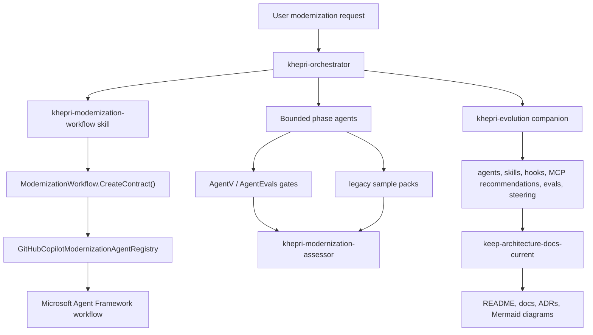
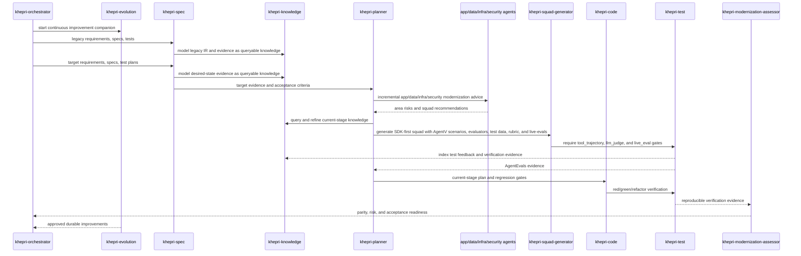
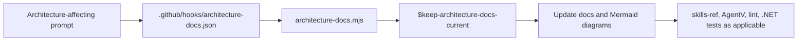

# Project Khepri

Project Khepri is an agent-driven modernization workflow control plane for legacy codebases. The current repository implements the agent contracts, workflow source of truth, evaluation gates, sample packs, hooks, skills, and contribution practices that keep modernization work evidence-backed.

This repo does not yet contain a production modernization runtime or all conceptual intermediary-representation tools. Those ideas are tracked as roadmap items below.

## Current Implementation

The implemented system has seven primary surfaces:

| Surface | Current files | Purpose |
| --- | --- | --- |
| GitHub custom agents | `.github/agents` | Bounded modernization roles, handoffs, tool access, queryable knowledge modeling, and guardrails. |
| .NET workflow contract | `dotnet/src/Modernization/Workflow` | Source of truth for stage order, required agents, AgentEvals gates, legacy scenarios, sample packs, and Microsoft Agent Framework workflow builders. |
| Agent Skills | `.github/skills` and `.copilot/skills` | Reusable procedures for Khepri workflow orchestration, learning corrections, Spec Kit, form building, and architecture-doc currency. |
| Agent hooks | `.github/hooks` | Deterministic prompt hooks for learning corrections and invoking the architecture-docs skill when architecture changes are requested. |
| AgentV evals | `evals/github-agents` | Code-grader-backed checks for agent profile schema, least-privilege tools, skill and hook contracts, steering, workflow code, and docs coverage. |
| Legacy sample packs | `evals/legacy-samples` | COBOL claims, legacy .NET Framework claims portal, and Java payment monolith fixtures used as regression evidence examples. |
| Squad and Spec Kit integration | `squad.config.ts`, `.squad`, `.specify`, `.agents` | Local squad, Spec Kit, and auxiliary agent assets for modernization planning and workflow automation. |

## Architecture



The modernization workflow stage order is implemented in `ModernizationWorkflow.CreateContract()`:



The architecture documentation enforcement path is also implemented:



## Agents

The active Khepri custom agents are:

- `khepri-orchestrator`: coordinates the workflow and delegates bounded phases.
- `khepri-evolution`: runs as the continuous improvement companion and improves agents, skills, hooks, MCP recommendations, evals, and steering.
- `khepri-spec`: extracts or generates legacy and target requirements, specs, tests, and test plans.
- `khepri-knowledge`: models IR, business context, standards, and verification evidence as a queryable knowledge base using whatever configured knowledge surface is available.
- `khepri-planner`: creates incremental modernization plans and stage-ready plans.
- `khepri-squad-generator`: generates SDK-first squads, AgentV scenarios, evaluators, test data, squad members, rubrics, and live-eval loops before implementation.
- `khepri-scaffold`: executes approved scaffolding and minimal target seams.
- `khepri-code`: implements approved behavior with TDD and legacy regression checks.
- `khepri-test`: runs reproducible tests, builds, AgentV, and AgentEvals checks.
- `khepri-modernization-assessor`: assesses parity, risk, acceptance evidence, and unresolved gaps.
- `app-modernization`, `data-modernization`, `infra-modernization`, `security-modernization`: advise on area-specific modernization patterns, risks, and regression checks.

See `docs/agents/README.md` for the full agent contract.

## Skills And Hooks

Implemented repo-local skills:

- `.github/skills/khepri-modernization-workflow`: calls the .NET workflow source of truth.
- `.github/skills/learn`: turns user corrections into generalized `STEERING.md` entries.
- `.github/skills/spec-kit`: documents local Spec Kit / Specify CLI usage.
- `.github/skills/keep-architecture-docs-current`: keeps current-state docs and Mermaid diagrams aligned with architecture changes.
- `.github/skills/form-builder`: imported form-building skill.

Implemented hooks:

- `.github/hooks/learn.json` calls `.github/hooks/scripts/learn.mjs` on prompt submission and captures reusable corrections.
- `.github/hooks/architecture-docs.json` calls `.github/hooks/scripts/architecture-docs.mjs` on prompt submission and instructs agents to invoke `$keep-architecture-docs-current` for architecture-affecting changes.

## Repository Layout

```text
.github/agents/       GitHub Copilot custom agent profiles
.github/hooks/        Prompt hooks and hook scripts
.github/instructions/ Global agent instructions compiled into AGENTS.md
.github/skills/       Repo-local Agent Skills
.github/workflows/    Squad and label/release workflows
.agentv/              AgentV target configuration
.agents/              Auxiliary local skills and agents
.copilot/             Copilot skill bundle and MCP config
.specify/             Spec Kit templates, scripts, and extension config
.squad/               Generated squad runtime docs and templates
docs/                 Current architecture and agent documentation
dotnet/               .NET workflow contract and tests
evals/                AgentV graders and legacy sample packs
python/prompts/       Legacy modernizer prompt guidance aligned to the current workflow
scripts/              Repository maintenance scripts
```

## Verification

Run the main agent and skill gates from the repository root:

```powershell
npm run lint:agents
npm run eval:agents:validate
npm run eval:agents
npm run skills:validate
```

Run the .NET workflow tests with:

```powershell
$env:DOTNET_ROLL_FORWARD='Major'; dotnet test dotnet\tests\Code2\NL\Code2NL.Tests.csproj
```

For squad-generated assets:

```powershell
npm run squad:check
```

## Roadmap Ideas

The following concepts are not implemented as shipped tools in this repository yet. They remain useful design directions for future increments:

- Code2 intermediary representations: natural-language summaries, comments, reference docs, JSON Schema, protobuf IDL, BDD docs, SBOM, Structurizr, TOSCA/CUE, test specs, and BPMN.
- Image2 and NL2 generation flows for UI code, design tokens, Structurizr, TOSCA/CUE, and BPMN.
- Production KnowledgeGraphRag, Planner4, runtime emulation, and reusable MCP servers for legacy-system inspection.
- Policy-as-code, workflow DSL, testing DSL, intermediate verification languages, and universal modeling DSL integrations.

Move any roadmap item into current-state docs only after implementation, tests, docs, diagrams, and validation gates are committed together.
