# Product Requirements Document (PRD): Agent Workflow System for Code Modernization

## Executive Summary

This document outlines the requirements for developing an intelligent multi-agent workflow system for legacy code modernization and knowledge management. The system leverages the Semantic Kernel Agent Framework with AgentChat and AgentGroupChat coordination, combined with the Semantic Kernel Process Framework for workflow orchestration, applying Test-Driven Development (TDD) principles based on Kent C. Beck's Testing Trophy methodology.

## Project Overview

### Vision
Create an autonomous multi-agent system that intelligently analyzes legacy codebases, generates comprehensive knowledge graphs, and orchestrates the modernization process through AI-driven planning, development, and validation.

### Objectives
- Automate legacy codebase analysis and knowledge extraction
- Generate comprehensive modernization plans with user collaboration
- Apply TDD methodology throughout the modernization process
- Ensure regression safety through automated test generation
- Coordinate multi-agent workflows using Semantic Kernel's agent orchestration patterns

## Technical Foundation

### Core Technologies
- **Agent Framework**: Semantic Kernel Agent Framework (latest version)
  - Core Package: `Microsoft.SemanticKernel` (C# .NET 8.0 SDK)
  - Agent Package: `Microsoft.SemanticKernel.Agents.Core` (prerelease)
  - Orchestration Package: `Microsoft.SemanticKernel.Agents.Orchestration` (prerelease)
  - ChatCompletionAgent for flexible AI service integration
  - AgentChat and AgentGroupChat for multi-agent coordination

- **Workflow Orchestration**: Semantic Kernel Process Framework (latest version)
  - Package: `Microsoft.SemanticKernel.Process.LocalRuntime` v1.46.0-alpha (experimental)
  - Alternative: `Microsoft.SemanticKernel.Process.Runtime.Dapr` v1.46.0-alpha
  - Event-driven architecture for step coordination

- **Application Hosting**: .NET Aspire Platform (latest stable)
  - Multi-project orchestration with independent agent scaling
  - Built-in service discovery, observability, and health monitoring
  - Each agent deployed as separate Aspire project for isolation and scalability

- **Development Methodology**: Test-Driven Development (TDD)
  - Based on Kent C. Beck's Testing Trophy principles
  - Red-Green-Refactor cycle implementation
  - Minimal code implementation approach

## Agent Architecture

### Core Agents

#### 1. Knowledge Agent (ChatCompletionAgent)
**Purpose**: Retrieve, generate, and index knowledge assets at multiple abstraction levels

**Implementation**: Semantic Kernel ChatCompletionAgent with specialized plugins for knowledge extraction and generation

**Responsibilities**:
- Analyze existing code comments and documentation
- Generate missing code documentation
- Create and maintain LSIF (Language Server Index Format) data
- Generate Gherkin behavior specifications
- Index knowledge assets in graph database
- Ingest existing knowledge when available
- Collaborate with Planning Agent for knowledge generation plans

**Capabilities**:
- Multi-level knowledge extraction (syntactic, semantic, behavioral)
- Knowledge graph construction and maintenance
- Document generation and validation
- Integration with existing documentation systems

**Knowledge Agent Workflow**:
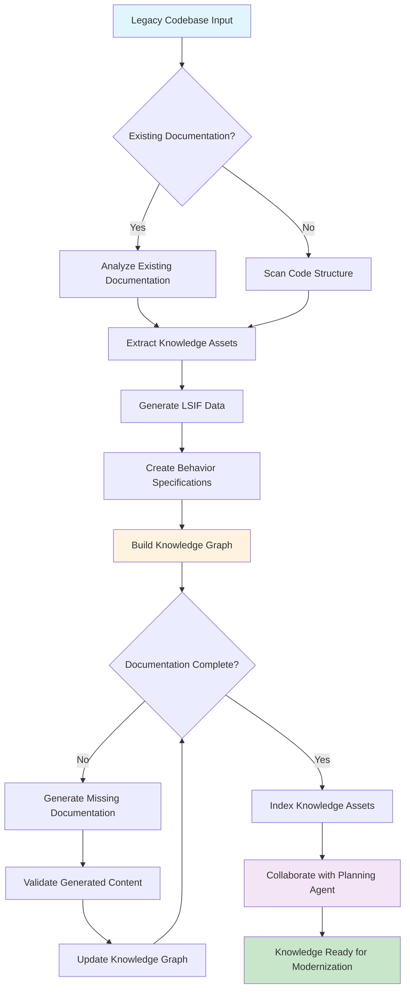

#### 2. Planning Agent (ChatCompletionAgent)
**Purpose**: Coordinate workflow planning and user collaboration for modernization efforts

**Implementation**: Semantic Kernel ChatCompletionAgent with specialized plugins for analysis and planning

**Responsibilities**:
- Index codebase and build initial knowledge graph
- Coordinate with Knowledge Agent for asset generation planning
- Generate modernization/migration plans
- Seek user approval for all plans and revisions
- Handle dependency analysis and architectural shift planning
- Generate Test-Driven Development plans
- Coordinate with Dev Agent for plan execution

**Capabilities**:
- Codebase analysis and indexing
- Dependency mapping and conflict resolution
- Migration path identification
- User collaboration workflows
- Plan versioning and approval tracking

**Planning Agent Workflow**:
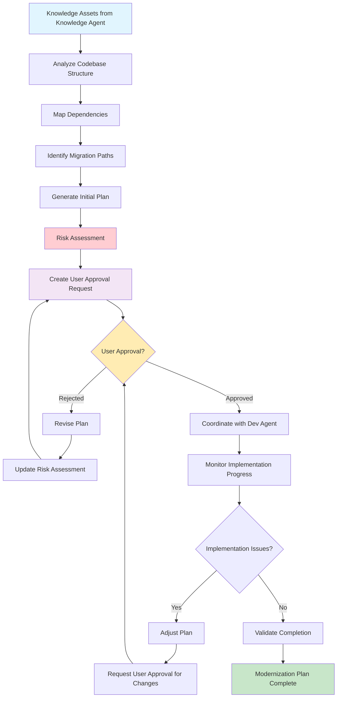

#### 3. Dev Agent (ChatCompletionAgent)
**Purpose**: Execute development tasks following TDD methodology

**Implementation**: Semantic Kernel ChatCompletionAgent with specialized plugins for code generation and testing

**Responsibilities**:
- Implement minimal code signatures to make tests pass
- Follow language-specific interface patterns:
  - TypeScript & C#: Interfaces
  - Python: Protocols and Abstract Base Classes
  - Swift: Protocols and Interfaces
- Generate regression test suites
- Apply red-green-refactor TDD cycles
- Implement bare minimum code without stubbing

**Capabilities**:
- Multi-language code generation
- Test-first development approach
- Incremental implementation
- Code quality validation

**Dev Agent TDD Workflow**:
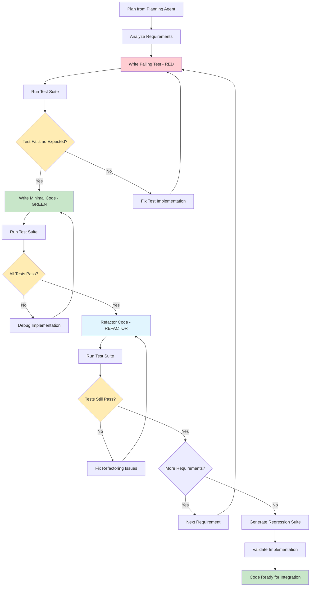

#### 4. User Delegation Agent (ChatCompletionAgent - Optional)
**Purpose**: Represent user interests and preferences in automated workflows

**Implementation**: Semantic Kernel ChatCompletionAgent with user preference modeling plugins

**Responsibilities**:
- Maintain user preferences and constraints
- Provide automated approval for predefined scenarios
- Escalate complex decisions to human users
- Track user feedback and learning patterns

**User Delegation Workflow**:
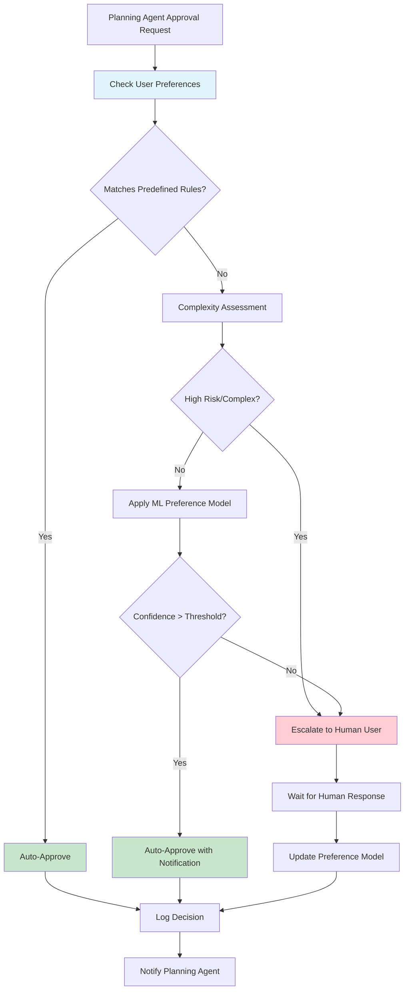

#### 5. Orchestration Agent (ChatCompletionAgent - Optional)
**Purpose**: High-level coordination and monitoring of the entire workflow

**Implementation**: Semantic Kernel ChatCompletionAgent with system monitoring and coordination plugins

**Responsibilities**:
- Monitor overall workflow health
- Handle cross-agent coordination issues
- Provide system-wide metrics and reporting
- Manage resource allocation and prioritization

## .NET Aspire Multi-Project Architecture

The modernization agent system is implemented as a distributed .NET Aspire application with each agent running as an independent project, enabling scalable and observable multi-agent workflows.

### Aspire Project Structure

**Application Composition**:
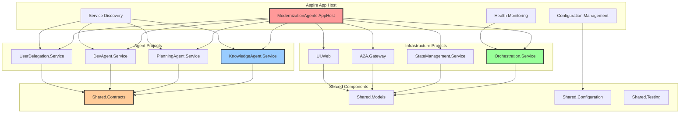

### Aspire Service Configuration

**AppHost Service Registration**:
```csharp
// ModernizationAgents.AppHost/Program.cs
var builder = DistributedApplication.CreateBuilder(args);

// Infrastructure Services
var stateStore = builder.AddRedis("state-store")
    .WithPersistence();
    
var eventBus = builder.AddRabbitMQ("event-bus")
    .WithManagementPlugin();

// Agent Services
var knowledgeAgent = builder.AddProject<Projects.KnowledgeAgent_Service>("knowledge-agent")
    .WithReference(stateStore)
    .WithReference(eventBus)
    .WithEnvironment("AGENT_TYPE", "Knowledge")
    .WithReplicas(2); // Scale based on workload

var planningAgent = builder.AddProject<Projects.PlanningAgent_Service>("planning-agent")
    .WithReference(stateStore)
    .WithReference(eventBus)
    .WithReference(knowledgeAgent)
    .WithEnvironment("AGENT_TYPE", "Planning");

var devAgent = builder.AddProject<Projects.DevAgent_Service>("dev-agent")
    .WithReference(stateStore)
    .WithReference(eventBus)
    .WithReference(planningAgent)
    .WithEnvironment("AGENT_TYPE", "Development");

var userDelegation = builder.AddProject<Projects.UserDelegation_Service>("user-delegation")
    .WithReference(stateStore)
    .WithReference(eventBus)
    .WithEnvironment("AGENT_TYPE", "UserDelegation");

// Orchestration Service
var orchestrator = builder.AddProject<Projects.Orchestration_Service>("orchestrator")
    .WithReference(stateStore)
    .WithReference(eventBus)
    .WithReference(knowledgeAgent)
    .WithReference(planningAgent)
    .WithReference(devAgent)
    .WithReference(userDelegation);

// Web UI
var webApp = builder.AddProject<Projects.UI_Web>("web-ui")
    .WithReference(orchestrator)
    .WithExternalHttpEndpoints();

// A2A Gateway for external agent communication
var a2aGateway = builder.AddProject<Projects.A2A_Gateway>("a2a-gateway")
    .WithReference(orchestrator)
    .WithExternalHttpEndpoints();

builder.Build().Run();
```

### Individual Agent Service Implementation

**Agent Service Template**:
```csharp
// KnowledgeAgent.Service/Program.cs
var builder = WebApplication.CreateBuilder(args);

// Add Aspire service discovery and observability
builder.AddServiceDefaults();

// Add Semantic Kernel with agent configuration
builder.Services.AddSingleton<Kernel>(serviceProvider =>
{
    var kernelBuilder = Kernel.CreateBuilder();
    kernelBuilder.AddAzureOpenAIChatCompletion(
        deploymentName: builder.Configuration["AI:DeploymentName"]!,
        endpoint: builder.Configuration["AI:Endpoint"]!,
        apiKey: builder.Configuration["AI:ApiKey"]!);
    return kernelBuilder.Build();
});

// Add agent-specific services
builder.Services.AddSingleton<KnowledgeAgent>();
builder.Services.AddSingleton<IAgentService, KnowledgeAgentService>();

// Add A2A protocol support
builder.Services.AddA2AAgent(options =>
{
    options.AgentName = "KnowledgeAgent";
    options.AgentDescription = "Specialized in legacy code analysis and knowledge extraction";
    options.WellKnownPath = "/.well-known/agent.json";
});

// Add state management
builder.Services.AddStackExchangeRedisCache(options =>
{
    options.Configuration = builder.Configuration.GetConnectionString("state-store");
});

// Add health checks
builder.Services.AddHealthChecks()
    .AddCheck<AgentHealthCheck>("agent-health");

var app = builder.Build();

// Map Aspire defaults (health checks, metrics, etc.)
app.MapDefaultEndpoints();

// Map A2A endpoints
app.MapA2AEndpoints();

// Map agent-specific endpoints
app.MapAgentEndpoints();

app.Run();
```

### Inter-Agent Communication with Aspire

**Service-to-Service Communication**:
```csharp
public class PlanningAgentService : IAgentService
{
    private readonly HttpClient _httpClient;
    private readonly ILogger<PlanningAgentService> _logger;
    
    public PlanningAgentService(HttpClient httpClient, ILogger<PlanningAgentService> logger)
    {
        _httpClient = httpClient;
        _logger = logger;
    }
    
    public async Task<PlanningResult> GeneratePlanAsync(KnowledgeGraph knowledgeGraph)
    {
        // Call Knowledge Agent through Aspire service discovery
        var knowledgeResponse = await _httpClient.GetFromJsonAsync<KnowledgeDetails>(
            "https+http://knowledge-agent/api/knowledge/details");
            
        // Generate modernization plan
        var plan = await GenerateModernizationPlan(knowledgeGraph, knowledgeResponse);
        
        // Notify User Delegation service
        await _httpClient.PostAsJsonAsync(
            "https+http://user-delegation/api/approval/request", 
            new ApprovalRequest { Plan = plan });
            
        return plan;
    }
}
```

### Aspire Observability and Monitoring

**Built-in Monitoring Stack**:
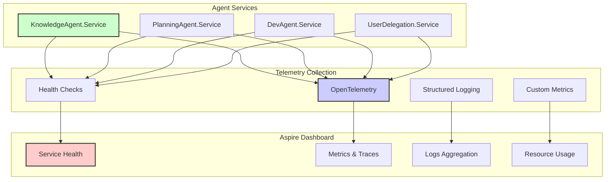

## Workflow Process

**Multi-Agent Modernization Workflow**:
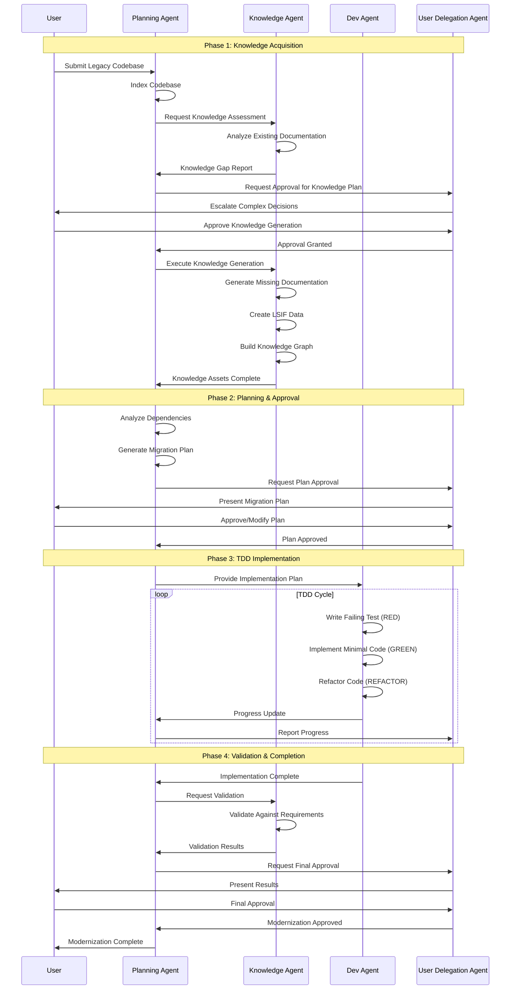

### Phase 1: Legacy System Knowledge Acquisition
1. **Initial Codebase Analysis**
   - Planning Agent indexes the legacy codebase
   - Knowledge graph construction begins
   - Dependency mapping and analysis

2. **Knowledge Asset Assessment**
   - Knowledge Agent evaluates existing documentation
   - Identifies gaps in code comments, docs, LSIF, Gherkin specs
   - Creates inventory of missing knowledge assets

3. **Knowledge Generation Planning**
   - Planning Agent collaborates with Knowledge Agent to create generation plan
   - User approval required for knowledge generation scope
   - Prioritization of knowledge assets based on modernization impact

4. **Knowledge Asset Generation**
   - Knowledge Agent generates missing assets per approved plan
   - Assets are validated and indexed in knowledge graph
   - Continuous integration with existing knowledge base

### Phase 2: Target System Analysis
1. **Technical Documentation Analysis**
   - Knowledge Agent analyzes target system technical docs
   - Modernization requirements extraction
   - Technology stack mapping

2. **Target Architecture Planning**
   - Planning Agent collaborates with user to define target architecture
   - Asset generation planning for target system documentation
   - User approval for target system scope

3. **Target Knowledge Base Construction**
   - Knowledge Agent generates target system knowledge assets
   - Integration with legacy system knowledge graph
   - Cross-reference mapping between legacy and target

### Phase 3: Migration/Modernization Planning
1. **Migration Analysis**
   - Planning Agent analyzes gaps between legacy and target systems
   - Dependency migration path identification
   - Architectural shift requirement analysis

2. **Test Strategy Development**
   - TDD approach planning following Kent C. Beck's Testing Trophy
   - Regression test suite generation planning
   - Test coverage strategy definition

3. **Migration Plan Generation**
   - Comprehensive migration plan creation
   - User collaboration for plan review and approval
   - Revision cycles based on user feedback

4. **Plan Approval Process**
   - Explicit user approval required for:
     - Dependency changes
     - Architectural shifts
     - Conflicting requirements resolution
     - Migration/upgrade paths
   - Plan versioning and change tracking

### Phase 4: Implementation Execution
1. **TDD Implementation Cycle**
   - Dev Agent follows red-green-refactor methodology
   - Test-first development approach
   - Minimal code implementation to pass tests
   - No stubbing - actual implementation required

2. **Regression Test Suite**
   - Comprehensive test generation for target system
   - Legacy system behavior preservation tests
   - Cross-system integration tests

3. **Iterative Development**
   - Continuous integration with test validation
   - Regular coordination with Planning Agent
   - User feedback integration

## Technical Specifications

### Core Technology Stack

1. **Semantic Kernel Agent Framework** (Primary)
   - Version: Latest Microsoft.SemanticKernel v1.46.0+
   - Agent Type: ChatCompletionAgent for all specialized agents
   - Coordination: AgentGroupChat for multi-agent collaboration
   - Plugin System: KernelPlugin for extensible functionality

2. **A2A Protocol Implementation** (Agent Communication)
   - Core Package: A2A (latest from https://github.com/a2aproject/a2a-dotnet)
   - Web Integration: A2A.AspNetCore for HTTP endpoints
   - Protocol Version: 0.2.6 compliance
   - Communication: JSON-RPC based with Server-Sent Events support
   - Discovery: AgentCard for capability advertising (.well-known/agent.json)

3. **Process Framework** (Workflow Engine)
   - Implementation: Microsoft.SemanticKernel.Process.LocalRuntime v1.46.0-alpha
   - Distributed Option: Microsoft.SemanticKernel.Process.Runtime.Dapr v1.46.0-alpha
   - Purpose: Orchestrate complex agent workflows and state management
   - Integration: Direct binding with ChatCompletionAgent instances

4. **.NET Aspire Hosting Platform** (Application Orchestration)
   - Version: .NET Aspire 8.0+ (latest stable)
   - Purpose: Multi-project orchestration and service discovery
   - Components: Aspire.Hosting for orchestration, service-to-service communication
   - Agent Deployment: Each agent runs as separate Aspire project with independent scaling
   - Integration: Built-in observability, health checks, and configuration management

5. **Development Methodology** (Testing Framework)
   - Approach: Test-Driven Development (TDD) following Kent C. Beck's Testing Trophy
   - Framework: xUnit for .NET testing with extensive mocking
   - Integration Testing: End-to-end agent workflow validation with Aspire TestHost

6. **Target Platform**
   - Framework: .NET 8.0 SDK
   - Languages: C# (primary), with multi-language code analysis support
   - Architecture: Cross-platform (Windows, Linux, macOS)
   - Hosting: .NET Aspire for local development and cloud deployment

### A2A Protocol Integration Architecture

The integration between A2A protocol and Semantic Kernel agents uses composition and interfaces to avoid type duplication while maintaining clean separation of concerns. Each agent maintains its Semantic Kernel capabilities while exposing A2A protocol interfaces for standardized communication.

**A2A and Semantic Kernel Integration Architecture**:
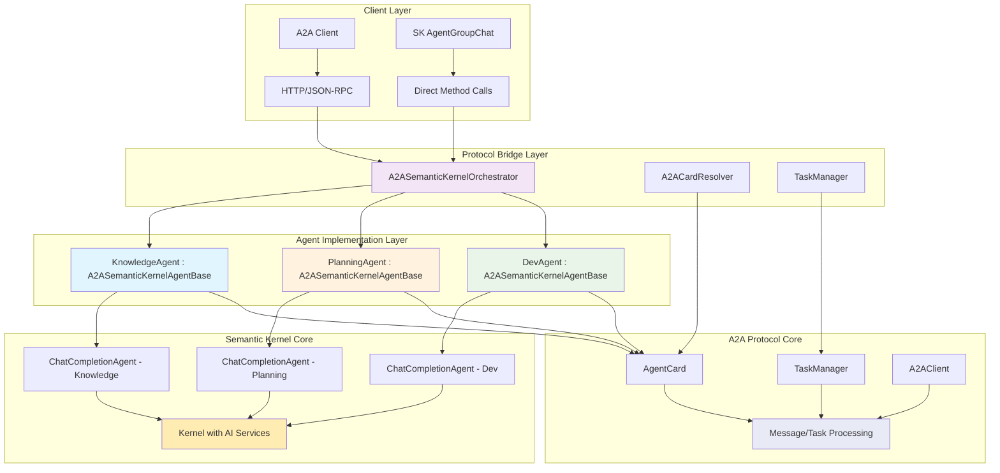

#### Design Principles and Benefits

**Composition over Inheritance**: Rather than inheriting from either A2A or Semantic Kernel base classes, the `ModernizationAgent` class composes both a `ChatCompletionAgent` and A2A protocol components, avoiding the diamond problem and maintaining flexibility.

**Single Source of Truth**: Agent metadata is defined once in shared interfaces (`IAgentMetadata`, `IAgentCapabilities`) and converted to both Semantic Kernel and A2A formats as needed, eliminating duplication.

**Protocol Agnostic**: The same agent can be accessed via Semantic Kernel's native APIs or through A2A protocol endpoints without code duplication or behavioral differences.

**Lazy Initialization**: A2A cards are created lazily to avoid overhead when only Semantic Kernel functionality is needed.

**Interface Segregation**: Small, focused interfaces (`IAgentMetadata`, `IAgentCapabilities`, `IAgentSkill`) ensure components only depend on what they actually use.

**Factory Pattern**: `ModernizationAgentFactory` encapsulates the complex setup while ensuring consistent configuration across all agent types.

#### Core Integration Interfaces
```csharp
// Interface for agent metadata that both SK and A2A can use
public interface IAgentMetadata
{
    string Name { get; }
    string Description { get; }
    string Version { get; }
    IReadOnlyList<string> InputModes { get; }
    IReadOnlyList<string> OutputModes { get; }
    IReadOnlyDictionary<string, object> Properties { get; }
}

// Interface for agent capabilities shared between protocols
public interface IAgentCapabilities
{
    bool SupportsStreaming { get; }
    bool SupportsPushNotifications { get; }
    bool SupportsStateHistory { get; }
    IReadOnlyList<IAgentSkill> Skills { get; }
}

// Unified skill interface
public interface IAgentSkill
{
    string Id { get; }
    string Name { get; }
    string Description { get; }
    IReadOnlyList<string> Tags { get; }
    IReadOnlyList<string> Examples { get; }
}

// Bridge interface for A2A and SK integration
public interface IA2ASemanticKernelBridge
{
    ChatCompletionAgent SemanticKernelAgent { get; }
    AgentCard A2ACard { get; }
    Task<AgentMessage> ProcessA2AMessageAsync(Message message, CancellationToken cancellationToken);
    Task<AgentTask> ProcessA2ATaskAsync(AgentTask task, CancellationToken cancellationToken);
}
```

#### Core Integration Architecture

The integration uses the dotnet A2A package directly with Semantic Kernel agents through composition and a base class hierarchy that provides common A2A functionality while preserving SK agent capabilities.

```csharp
// Base class for A2A-enabled Semantic Kernel agents
public abstract class A2ASemanticKernelAgentBase : IDisposable
{
    protected readonly ChatCompletionAgent _semanticKernelAgent;
    protected readonly ILogger _logger;
    private readonly Lazy<AgentCard> _agentCard;
    
    protected A2ASemanticKernelAgentBase(
        ChatCompletionAgent semanticKernelAgent,
        ILogger logger,
        string agentUrl)
    {
        _semanticKernelAgent = semanticKernelAgent ?? throw new ArgumentNullException(nameof(semanticKernelAgent));
        _logger = logger ?? throw new ArgumentNullException(nameof(logger));
        _agentCard = new Lazy<AgentCard>(() => CreateAgentCard(agentUrl));
    }

    // SK Agent access
    public ChatCompletionAgent SemanticKernelAgent => _semanticKernelAgent;
    
    // A2A Card access
    public AgentCard AgentCard => _agentCard.Value;

    // Abstract method for subclasses to define their agent card
    protected abstract AgentCard CreateAgentCard(string agentUrl);

    // Common A2A message processing using SK agent
    public virtual async Task<AgentMessage> ProcessMessageAsync(Message message, CancellationToken cancellationToken = default)
    {
        var userInput = ExtractTextFromMessage(message);
        
        // Use SK agent for processing with streaming support
        var responseContent = new StringBuilder();
        await foreach (var response in _semanticKernelAgent.InvokeAsync(userInput, cancellationToken: cancellationToken))
        {
            responseContent.Append(response.Message.Content);
        }

        return new AgentMessage
        {
            Role = MessageRole.Assistant,
            Parts = [new TextPart { Text = responseContent.ToString() }],
            Metadata = new Dictionary<string, string>
            {
                ["agent"] = AgentCard.Name,
                ["timestamp"] = DateTimeOffset.UtcNow.ToString("O"),
                ["protocol"] = "A2A-SK-Bridge"
            }
        };
    }

    // Common A2A task processing using SK agent
    public virtual async Task ExecuteTaskAsync(AgentTask task, ITaskManager taskManager, CancellationToken cancellationToken = default)
    {
        await taskManager.UpdateStatusAsync(task.Id, TaskState.Working, cancellationToken: cancellationToken);

        try
        {
            var userMessage = ExtractTextFromTask(task);
            var artifact = new Artifact();

            // Process with Semantic Kernel agent
            await foreach (var response in _semanticKernelAgent.InvokeAsync(userMessage, cancellationToken: cancellationToken))
            {
                artifact.Parts.Add(new TextPart { Text = response.Message.Content! });
            }

            // Return artifacts through A2A protocol
            await taskManager.ReturnArtifactAsync(task.Id, artifact, cancellationToken);
            await taskManager.UpdateStatusAsync(task.Id, TaskState.Completed, cancellationToken: cancellationToken);
        }
        catch (Exception ex)
        {
            _logger.LogError(ex, "Error processing A2A task {TaskId} for agent {AgentName}", task.Id, AgentCard.Name);
            await taskManager.UpdateStatusAsync(task.Id, TaskState.Failed, cancellationToken: cancellationToken);
            throw;
        }
    }

    protected static string ExtractTextFromMessage(Message message)
    {
        return string.Join("\n", message.Parts.OfType<TextPart>().Select(p => p.Text));
    }

    protected static string ExtractTextFromTask(AgentTask task)
    {
        return task.History?.LastOrDefault()?.Parts.OfType<TextPart>().FirstOrDefault()?.Text ?? string.Empty;
    }

    public virtual void Dispose()
    {
        // Base cleanup - subclasses can override for additional cleanup
        GC.SuppressFinalize(this);
    }
}

// Knowledge Agent implementation
public sealed class KnowledgeAgent : A2ASemanticKernelAgentBase
{
    public static readonly ActivitySource ActivitySource = new("A2A.KnowledgeAgent", "1.0.0");

    public KnowledgeAgent(ChatCompletionAgent semanticKernelAgent, ILogger logger, string agentUrl)
        : base(semanticKernelAgent, logger, agentUrl)
    {
    }

    protected override AgentCard CreateAgentCard(string agentUrl)
    {
        var capabilities = new AgentCapabilities
        {
            Streaming = false,
            PushNotifications = false,
            StateTransitionHistory = true,
            Extensions = []
        };

        var knowledgeSkill = new AgentSkill
        {
            Id = "legacy_knowledge_extraction",
            Name = "Legacy Code Knowledge Extraction",
            Description = "Analyzes legacy codebases to extract and generate knowledge assets including documentation, LSIF data, and behavior specifications.",
            Tags = ["knowledge", "documentation", "legacy-analysis", "semantic-kernel"],
            Examples = [
                "Analyze this C# codebase and generate comprehensive documentation",
                "Extract LSIF data from the legacy Java project for modernization",
                "Create behavior specifications for this legacy module"
            ]
        };

        return new AgentCard
        {
            Name = "Knowledge Agent",
            Description = "Semantic Kernel-based agent specialized in legacy code analysis and knowledge extraction for modernization workflows.",
            Url = agentUrl,
            Version = "1.0.0",
            ProtocolVersion = "0.2.6",
            DefaultInputModes = ["text"],
            DefaultOutputModes = ["text", "application/json"],
            Capabilities = capabilities,
            Skills = [knowledgeSkill],
            Provider = new AgentProvider
            {
                Organization = "Project Khepri",
                Url = "https://github.com/project-khepri"
            }
        };
    }

    // Specialized knowledge extraction processing
    public override async Task<AgentMessage> ProcessMessageAsync(Message message, CancellationToken cancellationToken = default)
    {
        using var activity = ActivitySource.StartActivity("ProcessKnowledgeMessage");
        activity?.SetTag("agent.type", "knowledge");
        
        // Add knowledge-specific context to the message
        var enhancedInput = $"""
            As a Knowledge Agent specialized in legacy code analysis, please process this request:
            
            {ExtractTextFromMessage(message)}
            
            Focus on extracting knowledge assets, generating documentation, and creating LSIF data where applicable.
            """;

        var enhancedMessage = new Message
        {
            Role = message.Role,
            Parts = [new TextPart { Text = enhancedInput }]
        };

        return await base.ProcessMessageAsync(enhancedMessage, cancellationToken);
    }
}

// Planning Agent implementation
public sealed class PlanningAgent : A2ASemanticKernelAgentBase
{
    public static readonly ActivitySource ActivitySource = new("A2A.PlanningAgent", "1.0.0");

    public PlanningAgent(ChatCompletionAgent semanticKernelAgent, ILogger logger, string agentUrl)
        : base(semanticKernelAgent, logger, agentUrl)
    {
    }

    protected override AgentCard CreateAgentCard(string agentUrl)
    {
        var capabilities = new AgentCapabilities
        {
            Streaming = false,
            PushNotifications = true,
            StateTransitionHistory = true,
            Extensions = []
        };

        var planningSkill = new AgentSkill
        {
            Id = "modernization_planning",
            Name = "Modernization Planning and Coordination",
            Description = "Analyzes dependencies, creates migration plans, and coordinates with other agents while ensuring user approval for major decisions.",
            Tags = ["planning", "coordination", "dependencies", "workflow"],
            Examples = [
                "Create a modernization plan for this legacy .NET Framework application",
                "Analyze dependencies between these modules for migration ordering",
                "Coordinate with knowledge and development agents for this workflow"
            ]
        };

        return new AgentCard
        {
            Name = "Planning Agent",
            Description = "Coordinates modernization workflows with dependency analysis and user-collaborative planning.",
            Url = agentUrl,
            Version = "1.0.0",
            ProtocolVersion = "0.2.6",
            DefaultInputModes = ["text"],
            DefaultOutputModes = ["text", "application/json"],
            Capabilities = capabilities,
            Skills = [planningSkill],
            Provider = new AgentProvider
            {
                Organization = "Project Khepri",
                Url = "https://github.com/project-khepri"
            }
        };
    }

    // Specialized planning processing with user approval points
    public override async Task<AgentMessage> ProcessMessageAsync(Message message, CancellationToken cancellationToken = default)
    {
        using var activity = ActivitySource.StartActivity("ProcessPlanningMessage");
        activity?.SetTag("agent.type", "planning");
        
        var enhancedInput = $"""
            As a Planning Agent responsible for modernization coordination, please process this request:
            
            {ExtractTextFromMessage(message)}
            
            Ensure you identify points requiring user approval and coordinate with other agents as needed.
            Include dependency analysis and migration ordering considerations.
            """;

        var enhancedMessage = new Message
        {
            Role = message.Role,
            Parts = [new TextPart { Text = enhancedInput }]
        };

        return await base.ProcessMessageAsync(enhancedMessage, cancellationToken);
    }
}

// Development Agent implementation
public sealed class DevAgent : A2ASemanticKernelAgentBase
{
    public static readonly ActivitySource ActivitySource = new("A2A.DevAgent", "1.0.0");

    public DevAgent(ChatCompletionAgent semanticKernelAgent, ILogger logger, string agentUrl)
        : base(semanticKernelAgent, logger, agentUrl)
    {
    }

    protected override AgentCard CreateAgentCard(string agentUrl)
    {
        var capabilities = new AgentCapabilities
        {
            Streaming = true,
            PushNotifications = false,
            StateTransitionHistory = true,
            Extensions = []
        };

        var tddSkill = new AgentSkill
        {
            Id = "tdd_implementation",
            Name = "Test-Driven Development Implementation",
            Description = "Implements minimal code to make tests pass, generates regression suites, and applies red-green-refactor cycles.",
            Tags = ["tdd", "testing", "implementation", "regression"],
            Examples = [
                "Generate tests for this legacy module before modernization",
                "Implement minimal code to pass these failing tests",
                "Create regression test suite for this refactored component"
            ]
        };

        return new AgentCard
        {
            Name = "Dev Agent",
            Description = "Test-driven development agent following Kent C. Beck's principles for legacy code modernization.",
            Url = agentUrl,
            Version = "1.0.0",
            ProtocolVersion = "0.2.6",
            DefaultInputModes = ["text"],
            DefaultOutputModes = ["text", "application/json", "text/plain"],
            Capabilities = capabilities,
            Skills = [tddSkill],
            Provider = new AgentProvider
            {
                Organization = "Project Khepri",
                Url = "https://github.com/project-khepri"
            }
        };
    }

    // Specialized TDD processing
    public override async Task<AgentMessage> ProcessMessageAsync(Message message, CancellationToken cancellationToken = default)
    {
        using var activity = ActivitySource.StartActivity("ProcessDevMessage");
        activity?.SetTag("agent.type", "development");
        
        var enhancedInput = $"""
            As a Development Agent following Test-Driven Development principles, please process this request:
            
            {ExtractTextFromMessage(message)}
            
            Apply red-green-refactor cycles, implement minimal code to make tests pass, 
            and ensure regression safety without stubbing implementations.
            """;

        var enhancedMessage = new Message
        {
            Role = message.Role,
            Parts = [new TextPart { Text = enhancedInput }]
        };

        return await base.ProcessMessageAsync(enhancedMessage, cancellationToken);
    }
}
```

#### Agent Factory with A2A Integration
```csharp
// Factory for creating A2A-enabled Semantic Kernel agents
public static class A2ASemanticKernelAgentFactory
{
    public static KnowledgeAgent CreateKnowledgeAgent(
        Kernel kernel, 
        ILogger logger,
        string agentUrl)
    {
        var semanticKernelAgent = new ChatCompletionAgent
        {
            Name = "KnowledgeAgent",
            Instructions = """
                You are a Knowledge Agent specialized in analyzing codebases and generating 
                comprehensive knowledge assets. Extract and generate code documentation, 
                maintain LSIF data, and create behavior specifications.
                
                Your expertise includes:
                - Legacy code analysis and documentation generation
                - LSIF (Language Server Index Format) data extraction
                - Behavior specification creation
                - Knowledge graph construction
                - Code comment and documentation analysis
                """,
            Kernel = kernel
        };

        return new KnowledgeAgent(semanticKernelAgent, logger, agentUrl);
    }

    public static PlanningAgent CreatePlanningAgent(
        Kernel kernel, 
        ILogger logger,
        string agentUrl)
    {
        var semanticKernelAgent = new ChatCompletionAgent
        {
            Name = "PlanningAgent",
            Instructions = """
                You are a Planning Agent responsible for coordinating modernization workflows.
                Analyze dependencies, create migration plans, and coordinate with other agents
                while ensuring user approval for all major decisions.
                
                Your responsibilities include:
                - Dependency analysis and migration ordering
                - User collaboration and approval workflows
                - Multi-agent coordination and task delegation
                - Risk assessment and mitigation planning
                - Progress tracking and status reporting
                """,
            Kernel = kernel
        };

        return new PlanningAgent(semanticKernelAgent, logger, agentUrl);
    }

    public static DevAgent CreateDevAgent(
        Kernel kernel, 
        ILogger logger,
        string agentUrl)
    {
        var semanticKernelAgent = new ChatCompletionAgent
        {
            Name = "DevAgent",
            Instructions = """
                You are a Development Agent that follows Test-Driven Development principles.
                Implement minimal code to make tests pass, generate regression suites,
                and apply red-green-refactor cycles without stubbing implementations.
                
                Your approach includes:
                - Red-Green-Refactor TDD cycles
                - Minimal implementation to pass tests
                - Comprehensive regression test suite generation
                - Code quality and maintainability focus
                - Integration with legacy code modernization workflows
                """,
            Kernel = kernel
        };

        return new DevAgent(semanticKernelAgent, logger, agentUrl);
    }
}
```

#### ASP.NET Core A2A Hosting with Direct A2A Package Integration
```csharp
// Program.cs for hosting A2A-enabled Semantic Kernel agents using the dotnet A2A package
using A2A;
using A2A.AspNetCore;
using Microsoft.SemanticKernel;
using Microsoft.SemanticKernel.Agents;
using OpenTelemetry.Resources;
using OpenTelemetry.Trace;

var builder = WebApplication.CreateBuilder(args);

// Configure services
builder.Services
    .AddHttpClient()
    .AddLogging()
    .AddOpenTelemetry()
    .ConfigureResource(resource => resource.AddService("ModernizationAgentServer"))
    .WithTracing(tracing => tracing
        .AddSource(TaskManager.ActivitySource.Name)
        .AddSource(A2AJsonRpcProcessor.ActivitySource.Name)
        .AddSource(KnowledgeAgent.ActivitySource.Name)
        .AddSource(PlanningAgent.ActivitySource.Name)
        .AddSource(DevAgent.ActivitySource.Name)
        .AddAspNetCoreInstrumentation()
        .AddHttpClientInstrumentation()
        .AddConsoleExporter());

var app = builder.Build();

// Initialize Kernel with AI services
var kernelBuilder = Kernel.CreateBuilder();
kernelBuilder.AddAzureOpenAIChatCompletion(
    deploymentName: app.Configuration["AzureOpenAI:DeploymentName"]!,
    endpoint: app.Configuration["AzureOpenAI:Endpoint"]!,
    apiKey: app.Configuration["AzureOpenAI:ApiKey"]!);
var kernel = kernelBuilder.Build();

// Create TaskManagers for each agent (required by A2A package)
var knowledgeTaskManager = new TaskManager();
var planningTaskManager = new TaskManager();
var devTaskManager = new TaskManager();

// Create A2A-enabled Semantic Kernel agents
var knowledgeAgent = A2ASemanticKernelAgentFactory.CreateKnowledgeAgent(
    kernel, app.Logger, "http://localhost:5000/knowledge");
var planningAgent = A2ASemanticKernelAgentFactory.CreatePlanningAgent(
    kernel, app.Logger, "http://localhost:5000/planning");
var devAgent = A2ASemanticKernelAgentFactory.CreateDevAgent(
    kernel, app.Logger, "http://localhost:5000/dev");

// Configure TaskManagers to use the agents for task execution
knowledgeTaskManager.RegisterTaskHandler(async (task, cancellationToken) =>
    await knowledgeAgent.ExecuteTaskAsync(task, knowledgeTaskManager, cancellationToken));

planningTaskManager.RegisterTaskHandler(async (task, cancellationToken) =>
    await planningAgent.ExecuteTaskAsync(task, planningTaskManager, cancellationToken));

devTaskManager.RegisterTaskHandler(async (task, cancellationToken) =>
    await devAgent.ExecuteTaskAsync(task, devTaskManager, cancellationToken));

// Map A2A endpoints using the dotnet A2A package
app.MapA2A(knowledgeTaskManager, "/knowledge");
app.MapA2A(planningTaskManager, "/planning");
app.MapA2A(devTaskManager, "/dev");

// Map agent card endpoints (.well-known/agent.json) using the dotnet A2A package
app.MapWellKnownAgentCard(() => Task.FromResult(knowledgeAgent.AgentCard), "/knowledge");
app.MapWellKnownAgentCard(() => Task.FromResult(planningAgent.AgentCard), "/planning");
app.MapWellKnownAgentCard(() => Task.FromResult(devAgent.AgentCard), "/dev");

// Add health endpoints with agent status
app.MapGet("/health", () => Results.Ok(new 
{ 
    Status = "Healthy", 
    Timestamp = DateTimeOffset.UtcNow,
    A2AProtocolVersion = "0.2.6",
    Agents = new[]
    {
        new { 
            Name = knowledgeAgent.AgentCard.Name, 
            Type = "Semantic Kernel + A2A",
            Status = "Ready",
            Capabilities = knowledgeAgent.AgentCard.Capabilities,
            Skills = knowledgeAgent.AgentCard.Skills.Select(s => s.Name)
        },
        new { 
            Name = planningAgent.AgentCard.Name, 
            Type = "Semantic Kernel + A2A",
            Status = "Ready",
            Capabilities = planningAgent.AgentCard.Capabilities,
            Skills = planningAgent.AgentCard.Skills.Select(s => s.Name)
        },
        new { 
            Name = devAgent.AgentCard.Name, 
            Type = "Semantic Kernel + A2A",
            Status = "Ready",
            Capabilities = devAgent.AgentCard.Capabilities,
            Skills = devAgent.AgentCard.Skills.Select(s => s.Name)
        }
    }
}));

// Add CORS for A2A agent communication
app.UseCors(policy => policy
    .AllowAnyOrigin()
    .AllowAnyMethod()
    .AllowAnyHeader());

await app.RunAsync();
```

#### Agent Discovery and Communication using A2A Package
```csharp
// A2A client orchestration using the dotnet A2A package
public class A2ASemanticKernelOrchestrator
{
    private readonly Dictionary<string, A2AClient> _agentClients = new();
    private readonly Dictionary<string, A2ASemanticKernelAgentBase> _localAgents = new();
    private readonly ILogger _logger;

    public A2ASemanticKernelOrchestrator(ILogger logger)
    {
        _logger = logger ?? throw new ArgumentNullException(nameof(logger));
    }

    // Register local agents for direct Semantic Kernel access (faster than A2A network calls)
    public void RegisterLocalAgent(A2ASemanticKernelAgentBase agent)
    {
        _localAgents[agent.AgentCard.Name] = agent;
        _logger.LogInformation("Registered local agent: {AgentName}", agent.AgentCard.Name);
    }

    // Discover and register remote A2A agents using the dotnet A2A package
    public async Task InitializeAgentDiscoveryAsync()
    {
        var agentEndpoints = new[]
        {
            "http://localhost:5000/knowledge",
            "http://localhost:5000/planning", 
            "http://localhost:5000/dev"
        };

        foreach (var endpoint in agentEndpoints)
        {
            try
            {
                // Use A2ACardResolver from the dotnet A2A package
                var cardResolver = new A2ACardResolver(new Uri(endpoint));
                var agentCard = await cardResolver.GetAgentCardAsync();
                
                // Create A2AClient from the dotnet A2A package
                var client = new A2AClient(new Uri(agentCard.Url));
                _agentClients[agentCard.Name] = client;
                
                _logger.LogInformation("Discovered A2A agent: {AgentName} at {Url} with protocol {Protocol}", 
                    agentCard.Name, agentCard.Url, agentCard.ProtocolVersion);
            }
            catch (Exception ex)
            {
                _logger.LogWarning(ex, "Failed to discover A2A agent at {Endpoint}", endpoint);
            }
        }
    }

    // Send message with automatic local/remote routing and SK/A2A protocol bridging
    public async Task<AgentMessage> SendMessageToAgentAsync(
        string agentName, 
        string message, 
        CancellationToken cancellationToken = default)
    {
        // Check for local Semantic Kernel agent first (faster, direct method call)
        if (_localAgents.TryGetValue(agentName, out var localAgent))
        {
            var localMessage = new Message
            {
                Role = MessageRole.User,
                Parts = [new TextPart { Text = message }]
            };
            
            // Direct call to local Semantic Kernel agent via A2A bridge
            return await localAgent.ProcessMessageAsync(localMessage, cancellationToken);
        }

        // Fall back to remote A2A agent communication using dotnet A2A package
        if (_agentClients.TryGetValue(agentName, out var client))
        {
            var response = await client.SendMessageAsync(new MessageSendParams
            {
                Message = new Message
                {
                    Role = MessageRole.User,
                    Parts = [new TextPart { Text = message }]
                }
            }, cancellationToken);

            return response as AgentMessage ?? 
                throw new InvalidOperationException($"Unexpected response type from A2A agent {agentName}");
        }

        throw new InvalidOperationException($"Agent {agentName} not found in local or remote A2A registrations");
    }

    // Create A2A task with proper task lifecycle management
    public async Task<AgentTask> CreateAgentTaskAsync(
        string agentName,
        string taskDescription,
        CancellationToken cancellationToken = default)
    {
        // Use A2A client for task creation to maintain proper A2A task lifecycle
        if (_agentClients.TryGetValue(agentName, out var client))
        {
            var response = await client.CreateTaskAsync(new TaskCreateParams
            {
                Message = new Message
                {
                    Role = MessageRole.User,
                    Parts = [new TextPart { Text = taskDescription }]
                }
            }, cancellationToken);

            return response as AgentTask ?? 
                throw new InvalidOperationException($"Unexpected response type from A2A task creation for {agentName}");
        }

        // For local agents, we can still create tasks but they won't have full A2A lifecycle
        if (_localAgents.TryGetValue(agentName, out var localAgent))
        {
            _logger.LogWarning("Creating task for local agent {AgentName} without full A2A lifecycle", agentName);
            
            // Create a simple task structure for local execution
            var task = new AgentTask
            {
                Id = Guid.NewGuid().ToString(),
                Status = TaskState.Running,
                History = [new Artifact
                {
                    Parts = [new TextPart { Text = taskDescription }]
                }]
            };

            // Execute directly with local agent
            await localAgent.ExecuteTaskAsync(task, new TaskManager(), cancellationToken);
            return task;
        }

        throw new InvalidOperationException($"Agent {agentName} not found for task creation");
    }

    // Get agent capabilities using A2A cards (no duplication)
    public IReadOnlyDictionary<string, AgentCard> GetAvailableAgentCapabilities()
    {
        var capabilities = new Dictionary<string, AgentCard>();

        // Add local agent capabilities from their A2A cards
        foreach (var (name, agent) in _localAgents)
        {
            capabilities[name] = agent.AgentCard;
        }

        // Remote agent capabilities are cached from discovery to avoid repeated network calls
        // This would be implemented with a cache refresh mechanism

        return capabilities;
    }

    // Semantic Kernel AgentGroupChat integration with A2A discovery
    public async Task<AgentGroupChat> CreateSemanticKernelGroupChatAsync()
    {
        var localSkAgents = _localAgents.Values
            .Select(a => a.SemanticKernelAgent)
            .ToArray();

        if (localSkAgents.Length == 0)
        {
            throw new InvalidOperationException("No local Semantic Kernel agents available for group chat");
        }

        var groupChat = new AgentGroupChat(localSkAgents)
        {
            ExecutionSettings = new AgentGroupChatSettings
            {
                SelectionStrategy = new SequentialSelectionStrategy(),
                TerminationStrategy = new RegexTerminationStrategy("TASK_COMPLETE|USER_APPROVAL_REQUIRED")
            }
        };

        _logger.LogInformation("Created Semantic Kernel AgentGroupChat with {AgentCount} agents", localSkAgents.Length);
        return groupChat;
    }
}
```

#### Complete Integration Usage Example
```csharp
// Example demonstrating seamless A2A and Semantic Kernel integration
public class ModernizationWorkflowExample
{
    private readonly A2ASemanticKernelOrchestrator _orchestrator;
    private readonly ILogger _logger;

    public ModernizationWorkflowExample(ILogger logger)
    {
        _logger = logger;
        _orchestrator = new A2ASemanticKernelOrchestrator(logger);
    }

    public async Task RunModernizationWorkflowAsync()
    {
        // 1. Initialize Semantic Kernel with AI services
        var kernel = Kernel.CreateBuilder()
            .AddAzureOpenAIChatCompletion("gpt-4", "https://your-openai.openai.azure.com/", "your-api-key")
            .Build();

        // 2. Create A2A-enabled Semantic Kernel agents using the factory
        var knowledgeAgent = A2ASemanticKernelAgentFactory.CreateKnowledgeAgent(
            kernel, _logger, "http://localhost:5000/knowledge");
        var planningAgent = A2ASemanticKernelAgentFactory.CreatePlanningAgent(
            kernel, _logger, "http://localhost:5000/planning");
        var devAgent = A2ASemanticKernelAgentFactory.CreateDevAgent(
            kernel, _logger, "http://localhost:5000/dev");

        // 3. Register local agents for direct Semantic Kernel access
        _orchestrator.RegisterLocalAgent(knowledgeAgent);
        _orchestrator.RegisterLocalAgent(planningAgent);
        _orchestrator.RegisterLocalAgent(devAgent);

        // 4. Discover remote A2A agents (if any)
        await _orchestrator.InitializeAgentDiscoveryAsync();

        // 5. Use individual agents via A2A protocol interface
        var knowledgeResponse = await _orchestrator.SendMessageToAgentAsync(
            "Knowledge Agent", 
            "Analyze this legacy C# codebase and extract documentation.");
        
        _logger.LogInformation("Knowledge Agent Response: {Response}", 
            knowledgeResponse.Parts.OfType<TextPart>().First().Text);

        // 6. Create A2A task for long-running operations
        var planningTask = await _orchestrator.CreateAgentTaskAsync(
            "Planning Agent",
            "Create a comprehensive modernization plan based on the knowledge analysis.");

        // 7. Use Semantic Kernel AgentGroupChat for collaborative workflows
        var groupChat = await _orchestrator.CreateSemanticKernelGroupChatAsync();
        
        await foreach (var message in groupChat.InvokeAsync(
            "Coordinate the modernization of this legacy application using TDD principles."))
        {
            _logger.LogInformation("[{Agent}]: {Content}", message.AuthorName, message.Content);
            
            // Handle user approval points from Planning Agent
            if (message.Content?.Contains("USER_APPROVAL_REQUIRED") == true)
            {
                var userResponse = await GetUserApprovalAsync(message.Content);
                await groupChat.AddChatMessageAsync(new ChatMessageContent(AuthorRole.User, userResponse));
            }
        }

        // 8. Access agent capabilities via A2A cards (no duplication)
        var capabilities = _orchestrator.GetAvailableAgentCapabilities();
        foreach (var (agentName, card) in capabilities)
        {
            _logger.LogInformation("Agent {AgentName} supports skills: {Skills}", 
                agentName, string.Join(", ", card.Skills.Select(s => s.Name)));
        }
    }

    private async Task<string> GetUserApprovalAsync(string approvalRequest)
    {
        // Simulate user interaction - in real implementation this would be UI/CLI input
        _logger.LogInformation("User approval required: {Request}", approvalRequest);
        await Task.Delay(100); // Simulate user thinking time
        return "Approved - proceed with the plan";
    }
}

// Startup configuration for complete integration
public class Startup
{
    public void ConfigureServices(IServiceCollection services)
    {
        services.AddLogging();
        services.AddHttpClient();
        
        // Register the orchestrator as a singleton
        services.AddSingleton<A2ASemanticKernelOrchestrator>();
        
        // Register the example workflow
        services.AddScoped<ModernizationWorkflowExample>();
    }

    public void Configure(IApplicationBuilder app, IWebHostEnvironment env)
    {
        // Standard ASP.NET Core A2A setup as shown above
        var orchestrator = app.ApplicationServices.GetRequiredService<A2ASemanticKernelOrchestrator>();
        
        // The agents would be created and registered here
        // as shown in the ASP.NET Core hosting example above
    }
}
```

### Semantic Kernel Agent Framework Implementation

#### Agent Creation and Configuration
```csharp
// Initialize Kernel with AI services
IKernelBuilder builder = Kernel.CreateBuilder();
builder.AddAzureOpenAIChatCompletion(deploymentName, endpoint, apiKey);
Kernel kernel = builder.Build();

// Create Knowledge Agent
ChatCompletionAgent knowledgeAgent = new()
{
    Name = "KnowledgeAgent",
    Instructions = """
        You are a Knowledge Agent specialized in analyzing codebases and generating 
        comprehensive knowledge assets. Extract and generate code documentation, 
        maintain LSIF data, and create behavior specifications.
        """,
    Kernel = kernel
};

// Create Planning Agent
ChatCompletionAgent planningAgent = new()
{
    Name = "PlanningAgent", 
    Instructions = """
        You are a Planning Agent responsible for coordinating modernization workflows.
        Analyze dependencies, create migration plans, and coordinate with other agents
        while ensuring user approval for all major decisions.
        """,
    Kernel = kernel
};

// Create Dev Agent
ChatCompletionAgent devAgent = new()
{
    Name = "DevAgent",
    Instructions = """
        You are a Development Agent that follows Test-Driven Development principles.
        Implement minimal code to make tests pass, generate regression suites,
        and apply red-green-refactor cycles without stubbing implementations.
        """,
    Kernel = kernel
};
```

#### AgentGroupChat Coordination
```csharp
// Create group chat for multi-agent coordination
AgentGroupChat groupChat = new(knowledgeAgent, planningAgent, devAgent)
{
    ExecutionSettings = new AgentGroupChatSettings
    {
        // Sequential selection strategy for structured workflow
        SelectionStrategy = new SequentialSelectionStrategy(),
        
        // Terminate when explicit approval is received or task completed
        TerminationStrategy = new RegexTerminationStrategy("TASK_COMPLETE|USER_APPROVAL_REQUIRED")
    }
};

// Execute multi-agent workflow
await foreach (var message in groupChat.InvokeAsync("Analyze legacy codebase and create modernization plan"))
{
    Console.WriteLine($"[{message.AuthorName}]: {message.Content}");
    
    // Handle user approval points
    if (message.Content.Contains("USER_APPROVAL_REQUIRED"))
    {
        var userResponse = await GetUserApproval(message.Content);
        await groupChat.AddChatMessageAsync(new ChatMessageContent(AuthorRole.User, userResponse));
    }
}
```

#### Agent Orchestration Patterns

**Orchestration Pattern Visualization**:
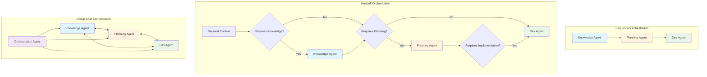

```csharp
// Sequential orchestration for structured workflow phases
var sequentialOrchestration = new SequentialOrchestration(
    knowledgeAgent,  // Phase 1: Knowledge extraction
    planningAgent,   // Phase 2: Planning and analysis
    devAgent         // Phase 3: Implementation
);

// Handoff orchestration for dynamic agent selection
var handoffOrchestration = new HandoffOrchestration()
    .AddAgent(knowledgeAgent, condition: ctx => ctx.RequiresKnowledgeExtraction)
    .AddAgent(planningAgent, condition: ctx => ctx.RequiresPlanning)
    .AddAgent(devAgent, condition: ctx => ctx.RequiresImplementation);

// Group chat orchestration for collaborative decision making
var groupChatOrchestration = new GroupChatOrchestration(
    agents: new[] { knowledgeAgent, planningAgent, devAgent },
    manager: orchestrationAgent // Optional manager for coordination
);
```

### Asynchronous Agent Coordination and State Propagation

The system implements event-driven coordination using Semantic Kernel Process Framework with optional Dapr runtime for distributed scenarios. This architecture provides both local and distributed execution capabilities while maintaining state consistency across agent workflows.

#### .NET Aspire + SK Process Framework + Dapr Architecture

**Aspire-Hosted Distributed Process Architecture**:
```mermaid
graph TB
    subgraph "Aspire Application Host"
        AAH1[ModernizationAgents.AppHost]
        AAH2[Service Discovery & Load Balancing]
        AAH3[Health Monitoring & Metrics]
        AAH4[Configuration Management]
    end
    
    subgraph "Agent Services (Aspire Projects)"
        AS1[KnowledgeAgent.Service]
        AS2[PlanningAgent.Service]
        AS3[DevAgent.Service]
        AS4[UserDelegation.Service]
    end
    
    subgraph "SK Process Framework (Per Service)"
        SPF1[ProcessBuilder - Knowledge]
        SPF2[ProcessBuilder - Planning]
        SPF3[ProcessBuilder - Dev]
        SPF4[ProcessBuilder - User]
        SPF5[ProcessRuntime (Dapr)]
        SPF6[ProcessEvents (Dapr PubSub)]
    end
    
    subgraph "Dapr Sidecars (Per Service)"
        DS1[Dapr Sidecar - Knowledge]
        DS2[Dapr Sidecar - Planning]
        DS3[Dapr Sidecar - Dev]
        DS4[Dapr Sidecar - User]
    end
    
    subgraph "Shared Dapr Components"
        DC1[State Store (Redis)]
        DC2[PubSub (RabbitMQ)]
        DC3[Service Invocation]
        DC4[Secrets Management]
    end
    
    AAH1 --> AS1
    AAH1 --> AS2
    AAH1 --> AS3
    AAH1 --> AS4
    
    AAH2 --> AS1
    AAH2 --> AS2
    AAH2 --> AS3
    AAH2 --> AS4
    
    AS1 --> SPF1
    AS1 --> DS1
    AS2 --> SPF2
    AS2 --> DS2
    AS3 --> SPF3
    AS3 --> DS3
    AS4 --> SPF4
    AS4 --> DS4
    
    SPF1 --> SPF5
    SPF2 --> SPF5
    SPF3 --> SPF5
    SPF4 --> SPF5
    
    SPF5 --> SPF6
    SPF6 --> DC2
    
    DS1 --> DC1
    DS1 --> DC2
    DS1 --> DC3
    DS2 --> DC1
    DS2 --> DC2
    DS2 --> DC3
    DS3 --> DC1
    DS3 --> DC2
    DS3 --> DC3
    DS4 --> DC1
    DS4 --> DC2
    DS4 --> DC3
    
    AAH3 --> AAH4
    AAH4 --> DC4
    
    style AAH1 fill:#ff9999,stroke:#333,stroke-width:3px
    style SPF5 fill:#99ccff,stroke:#333,stroke-width:2px
    style DC2 fill:#99ff99,stroke:#333,stroke-width:2px
    style DC1 fill:#ffcc99,stroke:#333,stroke-width:2px
```

#### SK Process Framework Event Flow

**Process-Based Agent Coordination**:
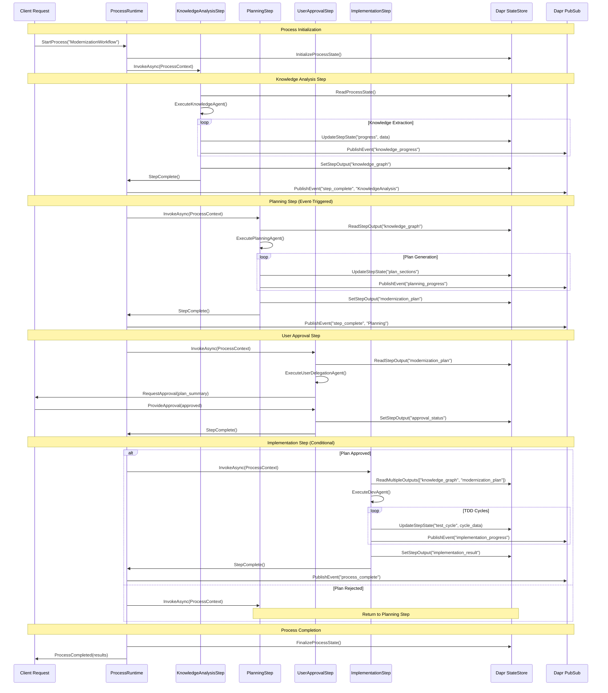

#### Dapr Building Blocks Integration

**State Management with Dapr State Store**:
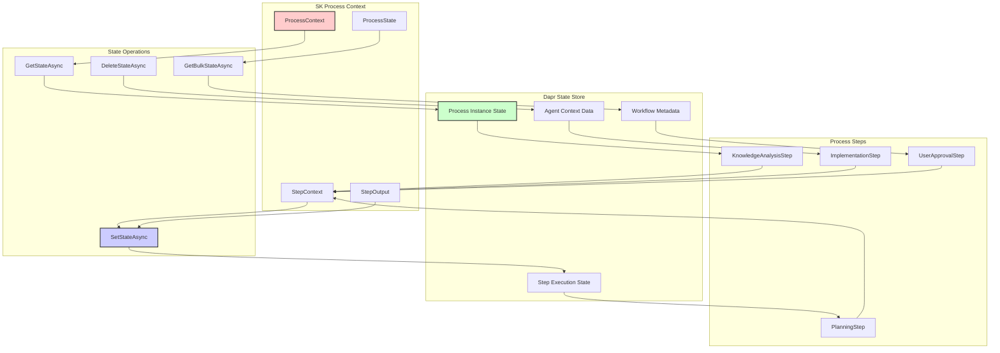

**Event Coordination with Dapr PubSub**:
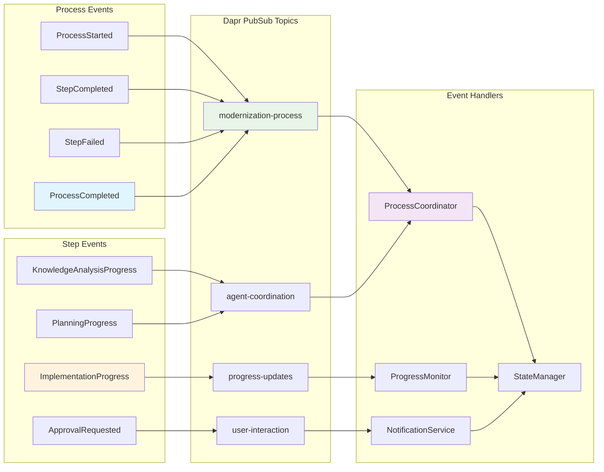

#### Aspire-Hosted Process Implementation Pattern

**Aspire Service with SK Process Framework**:
```csharp
// KnowledgeAgent.Service/Program.cs
var builder = WebApplication.CreateBuilder(args);

// Add Aspire service defaults (discovery, observability, health)
builder.AddServiceDefaults();

// Add Semantic Kernel with agent configuration
builder.Services.AddSingleton<Kernel>(serviceProvider =>
{
    var kernelBuilder = Kernel.CreateBuilder();
    kernelBuilder.AddAzureOpenAIChatCompletion(
        deploymentName: builder.Configuration["AI:DeploymentName"]!,
        endpoint: builder.Configuration["AI:Endpoint"]!,
        apiKey: builder.Configuration["AI:ApiKey"]!);
    return kernelBuilder.Build();
});

// Add SK Process Framework with Dapr runtime
builder.Services.AddSingleton<KernelProcessFactory>(serviceProvider =>
{
    var processBuilder = new ProcessBuilder("KnowledgeAnalysisWorkflow");
    
    var knowledgeStep = processBuilder
        .AddStepFromType<KnowledgeAnalysisStep>("AnalyzeCodebase")
        .SendEventTo(ProcessEvents.StepCompleted, "NotifyComplete");
        
    return new KernelProcessFactory(processBuilder.Build());
});

// Add Dapr client for state management and pub/sub
builder.Services.AddDapr(daprClientBuilder =>
{
    daprClientBuilder.UseHttpEndpoint(builder.Configuration["Dapr:HttpEndpoint"]!);
    daprClientBuilder.UseGrpcEndpoint(builder.Configuration["Dapr:GrpcEndpoint"]!);
});

// Add agent-specific services
builder.Services.AddSingleton<KnowledgeAgent>();
builder.Services.AddScoped<IKnowledgeAnalysisService, KnowledgeAnalysisService>();

var app = builder.Build();

// Map Aspire defaults (health checks, metrics, telemetry)
app.MapDefaultEndpoints();

// Map Dapr pub/sub endpoints
app.MapSubscribeHandler();

// Map agent-specific HTTP endpoints
app.MapKnowledgeAgentEndpoints();

app.Run();
```

**Process Step Implementation in Aspire Service**:
```csharp
public class KnowledgeAnalysisStep : ProcessStep
{
    private readonly KnowledgeAgent _knowledgeAgent;
    private readonly DaprClient _daprClient;
    private readonly ILogger<KnowledgeAnalysisStep> _logger;
    private readonly IServiceProvider _serviceProvider;

    public KnowledgeAnalysisStep(
        KnowledgeAgent knowledgeAgent, 
        DaprClient daprClient,
        ILogger<KnowledgeAnalysisStep> logger,
        IServiceProvider serviceProvider)
    {
        _knowledgeAgent = knowledgeAgent;
        _daprClient = daprClient;
        _logger = logger;
        _serviceProvider = serviceProvider;
    }

    [ProcessStepEdge]
    public async ValueTask AnalyzeAsync(ProcessStepContext context)
    {
        using var scope = _serviceProvider.CreateScope();
        var analysisService = scope.ServiceProvider.GetRequiredService<IKnowledgeAnalysisService>();
        
        try
        {
            // Read process state from Dapr state store
            var processState = await _daprClient.GetStateAsync<ProcessState>(
                "statestore", $"process-{context.ProcessId}");
                
            _logger.LogInformation("Starting knowledge analysis for process {ProcessId}", context.ProcessId);
            
            // Execute knowledge analysis using the agent
            var knowledgeGraph = await analysisService.AnalyzeCodebaseAsync(
                processState.SourceCodePath, context.CancellationToken);
                
            // Store results in Dapr state store
            await _daprClient.SetStateAsync("statestore", 
                $"knowledge-{context.ProcessId}", 
                knowledgeGraph,
                cancellationToken: context.CancellationToken);
                
            // Publish progress event via Dapr pub/sub
            await _daprClient.PublishEventAsync("pubsub", 
                "modernization-process", 
                new StepCompletedEvent
                {
                    ProcessId = context.ProcessId,
                    StepId = context.StepId,
                    StepType = "KnowledgeAnalysis",
                    CompletedAt = DateTimeOffset.UtcNow,
                    OutputData = new { KnowledgeGraphId = $"knowledge-{context.ProcessId}" }
                },
                cancellationToken: context.CancellationToken);
                
            _logger.LogInformation("Knowledge analysis completed for process {ProcessId}", context.ProcessId);
            
            // Emit process event to trigger next step
            context.EmitEvent(new ProcessEvent("StepCompleted"));
        }
        catch (Exception ex)
        {
            _logger.LogError(ex, "Knowledge analysis failed for process {ProcessId}", context.ProcessId);
            
            // Publish failure event
            await _daprClient.PublishEventAsync("pubsub",
                "modernization-process",
                new StepFailedEvent
                {
                    ProcessId = context.ProcessId,
                    StepId = context.StepId,
                    StepType = "KnowledgeAnalysis",
                    FailedAt = DateTimeOffset.UtcNow,
                    Error = ex.Message
                },
                cancellationToken: context.CancellationToken);
                
            context.EmitEvent(new ProcessEvent("StepFailed"));
            throw;
        }
    }
}
```

**Cross-Service Communication with Aspire + Dapr**:
```csharp
public class PlanningAgentService : IAgentService
{
    private readonly DaprClient _daprClient;
    private readonly HttpClient _httpClient;
    private readonly ILogger<PlanningAgentService> _logger;
    
    public PlanningAgentService(
        DaprClient daprClient, 
        HttpClient httpClient, 
        ILogger<PlanningAgentService> logger)
    {
        _daprClient = daprClient;
        _httpClient = httpClient;
        _logger = logger;
    }
    
    public async Task<PlanningResult> GeneratePlanAsync(string processId)
    {
        // Read knowledge graph from Dapr state store
        var knowledgeGraph = await _daprClient.GetStateAsync<KnowledgeGraph>(
            "statestore", $"knowledge-{processId}");
            
        // Call Knowledge Agent via Aspire service discovery for additional details
        var knowledgeDetails = await _httpClient.GetFromJsonAsync<KnowledgeDetails>(
            "https+http://knowledge-agent/api/knowledge/details?processId=" + processId);
            
        // Generate modernization plan
        var plan = await GenerateModernizationPlan(knowledgeGraph, knowledgeDetails);
        
        // Store plan in Dapr state
        await _daprClient.SetStateAsync("statestore", $"plan-{processId}", plan);
        
        // Notify User Delegation service via Dapr service invocation
        await _daprClient.InvokeMethodAsync(
            "user-delegation", 
            "api/approval/request", 
            new ApprovalRequest { ProcessId = processId, Plan = plan });
            
        return plan;
    }
}
```

#### Distributed State Resilience and Recovery

**Process State Management with Dapr**:
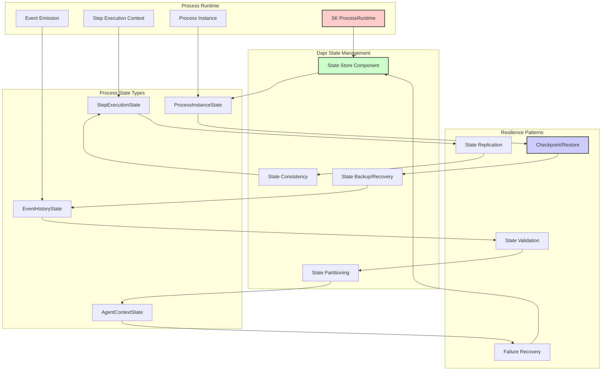

#### Event-Driven Communication Patterns

**Agent Communication Event Flow**:
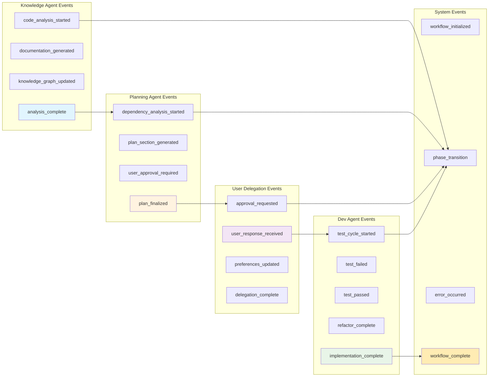

### Semantic Kernel Process Framework Integration
```csharp
// Process definition using Semantic Kernel Process Framework
var processBuilder = new ProcessBuilder("ModernizationWorkflow");

// Define workflow steps with agent integration
var knowledgeStep = processBuilder.AddStep<KnowledgeAnalysisStep>()
    .WithAgent(knowledgeAgent);
    
var planningStep = processBuilder.AddStep<PlanningStep>()
    .WithAgent(planningAgent);
    
var developmentStep = processBuilder.AddStep<DevelopmentStep>()
    .WithAgent(devAgent);

// Define step transitions and event handling
knowledgeStep.OnCompletion().SendEventTo(planningStep);
planningStep.OnUserApproval().SendEventTo(developmentStep);
planningStep.OnRevisionRequired().SendEventTo(knowledgeStep);

var process = processBuilder.Build();

// Execute process with agent coordination
await process.StartAsync("AnalyzeLegacyCodebase", new { codebasePath = "/path/to/legacy" });
```

### TDD Implementation Pattern
```csharp
// Example TDD cycle implementation with Semantic Kernel Agent
public interface IModernizationService  // Minimal interface first
{
    Task<MigrationPlan> GeneratePlanAsync(LegacyCodebase codebase);
}

// Test-first approach coordinated by Dev Agent
[Test]
public async Task GeneratePlan_WithValidCodebase_ReturnsValidPlan()
{
    // Arrange
    var devAgent = CreateDevAgent();
    var testPrompt = """
        Generate a minimal implementation for IModernizationService.GeneratePlanAsync
        that makes this test pass. Follow TDD principles - implement only what's needed.
        """;
    
    // Act - Dev Agent generates minimal implementation
    var implementation = await devAgent.InvokeAsync(testPrompt);
    
    // Assert
    Assert.NotNull(implementation);
    Assert.Contains("IModernizationService", implementation.Content);
}
```

## User Experience Requirements

### Collaboration Points
1. **Knowledge Generation Approval**: User must approve scope and priority of knowledge asset generation
2. **Target System Definition**: User collaborates on target architecture and requirements
3. **Migration Plan Review**: Explicit approval required for complete migration plan
4. **Dependency Resolution**: User input required for conflicting requirements
5. **Architectural Changes**: User approval for significant architectural shifts

### Approval Workflow
- All major decisions require explicit user approval
- Plan revisions must be re-approved
- User can request modifications at any approval point
- Version tracking for all approved plans
- Rollback capability for rejected changes

## Quality Assurance

### TDD Compliance
- All development follows red-green-refactor cycle
- Tests written before implementation
- Minimal code to pass tests (no over-engineering)
- No stubbed implementations allowed
- Comprehensive regression suite generation

### Testing Strategy
Based on Kent C. Beck's Testing Trophy:
- **Unit Tests**: Core business logic validation
- **Integration Tests**: Agent communication and workflow validation
- **System Tests**: End-to-end modernization workflow validation
- **Regression Tests**: Legacy system behavior preservation

## Success Criteria

### Functional Requirements
1. ✅ Successful multi-agent coordination using Semantic Kernel AgentChat
2. ✅ Comprehensive knowledge graph generation and maintenance
3. ✅ User-collaborative modernization planning
4. ✅ TDD-compliant development execution
5. ✅ Regression-safe modernization implementation

### Technical Requirements
1. ✅ Integration with Semantic Kernel Agent Framework
2. ✅ Semantic Kernel Process Framework workflow orchestration
3. ✅ .NET Aspire multi-project deployment and orchestration
4. ✅ Dapr-enabled distributed state management and event coordination
5. ✅ Multi-language support (C#, TypeScript, Python, Swift)
6. ✅ Scalable knowledge graph storage and querying
7. ✅ Comprehensive test coverage and validation
8. ✅ A2A protocol integration for agent communication

### Project Structure Requirements
1. ✅ **Aspire Application Host**: Central orchestration and service discovery
2. ✅ **Independent Agent Services**: Each agent as separate Aspire project
   - KnowledgeAgent.Service (with scaling capabilities)
   - PlanningAgent.Service
   - DevAgent.Service  
   - UserDelegation.Service
3. ✅ **Infrastructure Services**: Shared components as Aspire projects
   - Orchestration.Service (SK Process Framework coordination)
   - StateManagement.Service (Dapr state management)
   - A2A.Gateway (External agent communication)
   - UI.Web (User interface)
4. ✅ **Shared Libraries**: Cross-cutting concerns
   - Shared.Contracts (A2A and SK integration interfaces)
   - Shared.Models (Domain models and DTOs)
   - Shared.Configuration (Aspire configuration helpers)
   - Shared.Testing (Test utilities and Aspire TestHost integration)

### User Experience Requirements
1. ✅ Clear approval workflows with revision capabilities
2. ✅ Transparent progress tracking and reporting
3. ✅ Intuitive collaboration interfaces
4. ✅ Comprehensive documentation and help systems
5. ✅ Reliable rollback and recovery mechanisms

## Risk Assessment

### Technical Risks
- **Semantic Kernel Agent Framework**: Currently in experimental/prerelease stage
- **Semantic Kernel Process Framework**: Currently experimental (v1.46.0-alpha)
- **.NET Aspire**: Relatively new platform (8.0+) with evolving tooling and ecosystem
- **Dapr Integration**: Complexity in distributed state management and debugging
- **A2A Protocol**: Integration complexity with Semantic Kernel agent lifecycle
- **Semantic Kernel Process Framework**: Currently experimental (v1.46.0-alpha)
- **Agent Coordination Complexity**: Multi-agent systems can have emergent behaviors
- **Knowledge Graph Scale**: Large codebases may require significant storage and processing

### Mitigation Strategies
- Implement comprehensive testing for all agent interactions
- Use feature flags for experimental components
- Design modular architecture for easy component replacement
- Implement monitoring and alerting for workflow health
- Leverage Semantic Kernel's built-in orchestration patterns for reliable coordination

## Timeline and Milestones

### Phase 1: Foundation (4-6 weeks)
- .NET Aspire application host setup and project structure
- Semantic Kernel Agent Framework setup and configuration
- ChatCompletionAgent implementation for core agents
- Dapr infrastructure setup (state store, pub/sub)
- Basic AgentChat and AgentGroupChat coordination
- Aspire service discovery and health monitoring configuration

### Phase 2: Agent Service Development (6-8 weeks)
- Individual agent services as separate Aspire projects
- Knowledge Agent development with specialized plugins
- Graph database integration with Dapr state management
- Multi-level knowledge extraction capabilities
- Inter-service communication via Aspire + Dapr

### Phase 3: Planning and Collaboration (4-6 weeks)
- Planning Agent implementation with orchestration capabilities
- User collaboration workflows using AgentChat
- User Delegation service with Aspire integration
- Approval and revision systems integration
- Cross-service event coordination

### Phase 4: Process Framework Integration (6-8 weeks)
- Semantic Kernel Process Framework integration across services
- Dev Agent implementation with TDD plugins and process steps
- Distributed workflow orchestration with Dapr runtime
- Process state management and resilience patterns
- Semantic Kernel Process Framework integration
- Regression testing capabilities

### Phase 5: Integration and Testing (4-6 weeks)
- End-to-end workflow testing with agent orchestration
- Performance optimization
- Documentation and training materials

## Dependencies and Prerequisites

### External Dependencies
- **Semantic Kernel Agent Framework**
  - Microsoft.SemanticKernel (v1.46.0+)
  - Microsoft.SemanticKernel.Agents.Core (prerelease)
  - Microsoft.SemanticKernel.Agents.Orchestration (prerelease)
- **Semantic Kernel Process Framework** 
  - Microsoft.SemanticKernel.Process.LocalRuntime (v1.46.0-alpha)
- **A2A Protocol Implementation**
  - A2A (latest from https://github.com/a2aproject/a2a-dotnet)
  - A2A.AspNetCore (latest from https://github.com/a2aproject/a2a-dotnet)
- **Infrastructure Services**
  - Azure infrastructure for agent hosting and AI services
  - Graph database solution (e.g., Neo4j, Azure Cosmos DB)
  - HTTP client infrastructure for A2A agent communication

### Internal Dependencies
- .NET 8.0 development environment
- CI/CD pipeline setup
- Testing framework configuration
- Documentation system implementation

## Conclusion

This PRD outlines a comprehensive approach to building an intelligent multi-agent system for code modernization using the Semantic Kernel Agent Framework. By leveraging Semantic Kernel's ChatCompletionAgent, AgentChat coordination, and proven orchestration patterns, combined with the Process Framework, the system will provide a robust, user-collaborative solution for legacy code modernization challenges.

The emphasis on Test-Driven Development, explicit user approval workflows, and comprehensive knowledge management ensures that modernization efforts are both technically sound and aligned with business requirements. The use of Semantic Kernel's experimental but rapidly maturing agent capabilities provides a solid foundation for building sophisticated multi-agent workflows.

---

**Document Version**: 1.0  
**Last Updated**: September 1, 2025  
**Next Review**: September 15, 2025
