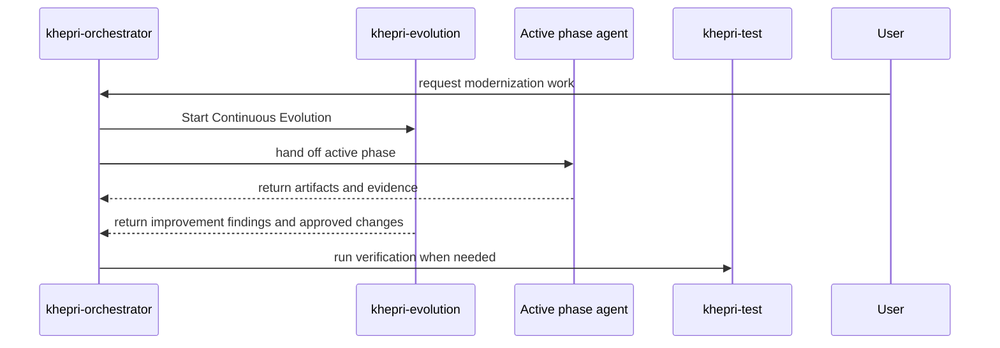

# GitHub Custom Agents

Project Khepri defines repository-level GitHub Copilot custom agents in `.github/agents`.
The profiles formalize the docs-branch modernization flow as bounded subagents:

- `khepri-orchestrator` coordinates the phase sequence and invokes subagents.
- `khepri-spec` collects and generates intermediary representations.
- `khepri-knowledge` indexes IR, business context, standards, and test results.
- `khepri-planner` creates approval-ready regression, scaffolding, test, and implementation plans.
- `khepri-scaffold` executes approved scaffolding and minimal type-signature plans.
- `khepri-code` writes tests first, implements behavior, and handles test feedback.
- `khepri-test` runs reproducible verification commands.
- `khepri-modernization-assessor` checks parity, risk, and acceptance evidence.
- `khepri-evolution` creates and improves project Agent Skills, hooks, evals, and steering.

## Current Execution Model

The orchestrator starts `khepri-evolution` first using frontmatter handoffs, then invokes
the phase owner for the active modernization step. `khepri-evolution` stays alongside
that work as a non-blocking companion unless it finds a safety, correctness, steering,
or approval issue that needs user attention.



`khepri-evolution` runs alongside all other agent work as the workflow's continuous
improvement companion. The orchestrator starts it first, then keeps it informed about
phase handoffs, evidence, failures, and user corrections so parallel improvement keeps
the agent system getting better while modernization work proceeds.

`khepri-evolution` also has the official Awesome Copilot MCP server configured as
`awesome-copilot/*`. It uses that server to recommend agents, skills, MCPs, tools,
hooks, plugins, instructions, prompts, workflows, and other Copilot customizations
that could improve modernization outcomes. Recommendations stay advisory until the
user approves a specific candidate to inspect, install, or adapt.

All agents read `STEERING.md` before phase work. User corrections are captured by the
`learn` Agent Skill in `.github/skills/learn` and the `learn` GitHub hook in
`.github/hooks/learn.json`.

Workflow orchestration is encoded in each agent profile's YAML frontmatter with the
official custom-agent `handoffs` object syntax:

```yaml
handoffs:
  - label: Run Verification
    agent: khepri-test
    prompt: Run the required Project Khepri verification commands.
    send: false
```

GitHub's cloud-agent reference currently accepts the field for compatibility but notes
that GitHub.com ignores IDE handoff buttons today. Keeping the frontmatter current makes
the workflow usable in IDE custom agents now and ready for GitHub.com support later.

Frontmatter correctness is enforced by:

```powershell
npm run lint:agents
```

The AgentEvals/AgentV suite is in `evals/github-agents/khepri-github-agents.eval.yaml`.
Run it with:

```powershell
npm run eval:agents
```

Validate the eval definition with:

```powershell
npm run eval:agents:validate
```

Validate the AgentV target file and project skill metadata with:

```powershell
npx agentv validate .agentv\targets.yaml --max-warnings 0
npm run skills:validate
```

Run the current .NET smoke test with:

```powershell
$env:DOTNET_ROLL_FORWARD='Major'; dotnet test dotnet\tests\Code2\NL\Code2NL.Tests.csproj
```
