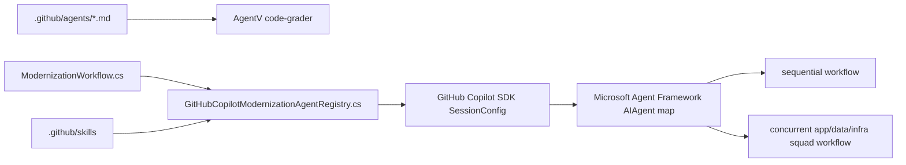
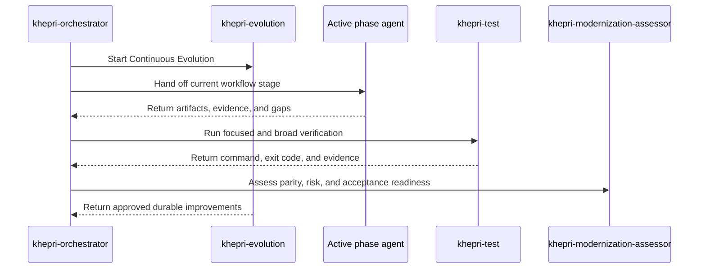

# Project Khepri Custom Agents

Project Khepri defines repository-level GitHub Copilot custom agents in `.github/agents` and registers their runtime equivalents in `dotnet/src/Modernization/Workflow/GitHubCopilotModernizationAgentRegistry.cs`.

## Implemented Agents

| Agent | Role | Edit access |
| --- | --- | --- |
| `khepri-orchestrator` | Coordinates the workflow and delegates bounded phases. | No |
| `khepri-evolution` | Improves agents, skills, hooks, MCP recommendations, evals, docs, and steering while phase work proceeds. | Yes |
| `khepri-spec` | Extracts or generates requirements, specs, tests, and test plans from legacy and target systems. | Yes |
| `khepri-knowledge` | Indexes IR, business context, standards, and verification evidence. | Yes |
| `khepri-planner` | Creates incremental and stage-ready modernization plans. | Yes |
| `khepri-scaffold` | Executes approved scaffolding and minimal type-signature plans. | Yes |
| `khepri-code` | Implements approved behavior with tests first. | Yes |
| `khepri-test` | Runs reproducible verification commands. | No |
| `khepri-modernization-assessor` | Assesses parity, risk, acceptance evidence, and unresolved gaps. | No |
| `app-modernization` | Advises on application modernization patterns. | No |
| `data-modernization` | Advises on data modernization patterns. | No |
| `infra-modernization` | Advises on infrastructure modernization patterns. | No |

Frontmatter correctness and least-privilege tool access are checked by `npm run lint:agents` and `npm run eval:agents`.

## Runtime Source Of Truth

The .NET registry currently:

- creates `CustomAgentConfig` entries for every required Khepri agent;
- sets `khepri-orchestrator` as the default session agent;
- enables subagent streaming;
- loads `.github/skills` and `.copilot/skills`;
- preloads `khepri-modernization-workflow` and `keep-architecture-docs-current` for the orchestrator;
- preloads `keep-architecture-docs-current` for `khepri-evolution`;
- builds Microsoft Agent Framework `AIAgent` wrappers around the GitHub Copilot SDK agents.



## Workflow Handoffs

The orchestrator starts `khepri-evolution` first, then delegates the active phase. The implemented high-level order is:

1. Legacy requirements, specs, and regression seed tests.
2. Target requirements, specs, and test plans.
3. Incremental modernization planning.
4. App/data/infra squad generation with AgentEvals gates.
5. Current-stage plan refinement.
6. TDD modernization execution and assessment.



GitHub custom-agent frontmatter uses the official `handoffs` object shape. GitHub.com may not expose every IDE handoff affordance yet, but keeping the frontmatter current preserves compatibility and keeps the contract machine-checkable.

## Skills And Hooks Used By Agents

- `khepri-modernization-workflow`: entrypoint for the .NET workflow source of truth.
- `learn`: captures user corrections into `STEERING.md`.
- `keep-architecture-docs-current`: required for architecture-affecting changes so docs and Mermaid diagrams match implementation.
- `spec-kit`: local Spec Kit and Specify CLI guidance.

Hooks under `.github/hooks` provide deterministic reminders and lightweight capture:

- `learn.json` writes generalized corrections through `learn.mjs`.
- `architecture-docs.json` emits an instruction to invoke `$keep-architecture-docs-current` when prompts indicate architecture-affecting changes.

## Steering

All Khepri agents read `STEERING.md` before phase work. Corrections should be succinct, generalized, and free of secrets or long transcripts. If a correction implies a reusable workflow, `khepri-evolution` should add or update the relevant skill, hook, eval, or instruction.

## Validation

Run these checks after agent, skill, hook, instruction, eval, or workflow changes:

```powershell
npm run lint:agents
npm run eval:agents:validate
npm run eval:agents
npm run skills:validate
```

Run the .NET workflow tests after changing the workflow contract, registry, or workflow skill behavior:

```powershell
$env:DOTNET_ROLL_FORWARD='Major'; dotnet test dotnet\tests\Code2\NL\Code2NL.Tests.csproj
```
