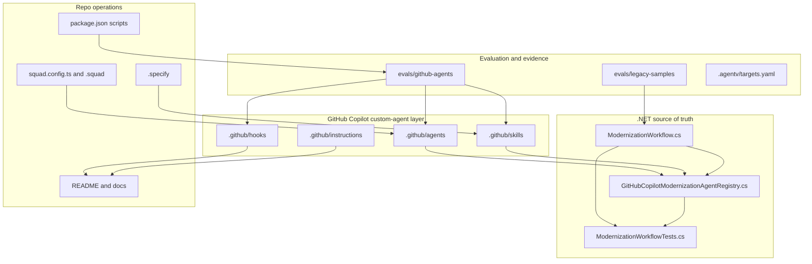
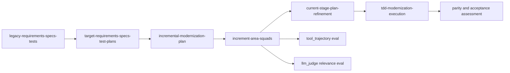
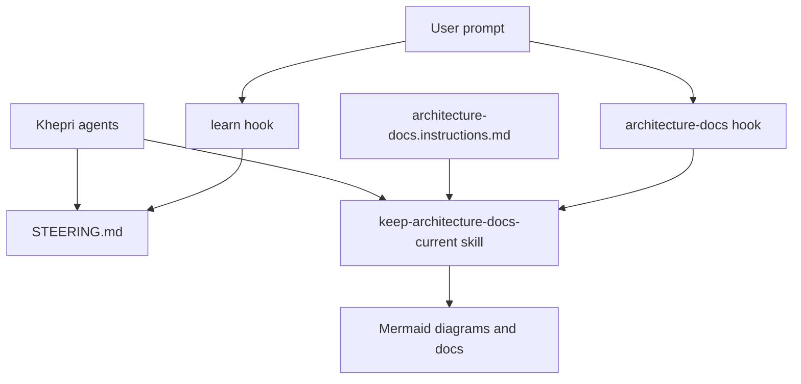
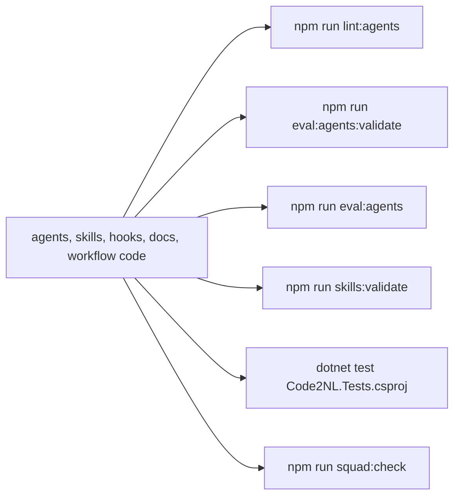

# Project Khepri Architecture

This document describes the architecture currently implemented in this repository.

## Current Implementation

Project Khepri is implemented as an agent-workflow control plane. The current codebase defines how modernization work is coordinated, evaluated, and documented; it does not yet ship a production modernization runtime.

## Workflow Contract

`ModernizationWorkflow.CreateContract()` defines six implemented stages:

| Order | Stage id | Required agents | Required evidence |
| --- | --- | --- | --- |
| 1 | `legacy-requirements-specs-tests` | `khepri-spec`, `khepri-knowledge`, `khepri-test` | Source evidence, legacy behavior inventory, legacy regression seed tests |
| 2 | `target-requirements-specs-test-plans` | `khepri-spec`, `khepri-knowledge`, `khepri-planner` | Target desired-state evidence, acceptance criteria, test-PLANS |
| 3 | `incremental-modernization-plan` | `khepri-planner`, `app-modernization`, `data-modernization`, `infra-modernization` | Increment map, area risks, approval checkpoints |
| 4 | `increment-area-squads` | Area modernization agents, `khepri-code`, `khepri-test` | AgentEvals, `tool_trajectory`, `llm_judge` relevance evidence |
| 5 | `current-stage-plan-refinement` | `khepri-planner`, area modernization agents | Stage-ready plan, dependencies, rollback plan, regression gates |
| 6 | `tdd-modernization-execution` | `khepri-code`, `khepri-test`, `khepri-modernization-assessor` | Legacy regression checks, red/green/refactor evidence, AgentEvals rerun, acceptance evidence |

## Custom-Agent Runtime

`GitHubCopilotModernizationAgentRegistry.CreateSessionConfig(...)` builds a GitHub Copilot SDK session with:

- client name `project-khepri-modernization-workflow`;
- default agent `khepri-orchestrator`;
- model default `gpt-5.3-codex`;
- subagent streaming enabled;
- skill directories `.github/skills` and `.copilot/skills`;
- repo custom agents from the registry.

The orchestrator preloads `khepri-modernization-workflow` and `keep-architecture-docs-current`. The evolution agent also preloads `keep-architecture-docs-current` so workflow-surface changes include docs and Mermaid updates.

## Skills, Hooks, And Instructions

The architecture-docs hook does not edit files directly. It emits an invocation instruction for `$keep-architecture-docs-current`, keeping judgment with the agent while making the requirement hard to miss.

## Legacy Sample Packs

The workflow source of truth references three implemented sample packs:

- `evals/legacy-samples/cobol-claims`: COBOL claims batch/CICS source-shaped artifacts, fixed-width fixtures, and report parity evidence.
- `evals/legacy-samples/dotnet-framework-claims-portal`: legacy .NET Framework/IIS route, service, sweep, config, and HTTP golden-master evidence.
- `evals/legacy-samples/java-payment-monolith`: Java servlet/JMS/DAO artifacts and JMS replay evidence.

These are deterministic fixtures for agent and workflow evals, not full legacy-system emulators.

## Validation Architecture

Use focused validation first, then broader gates once the focused signal is green.
