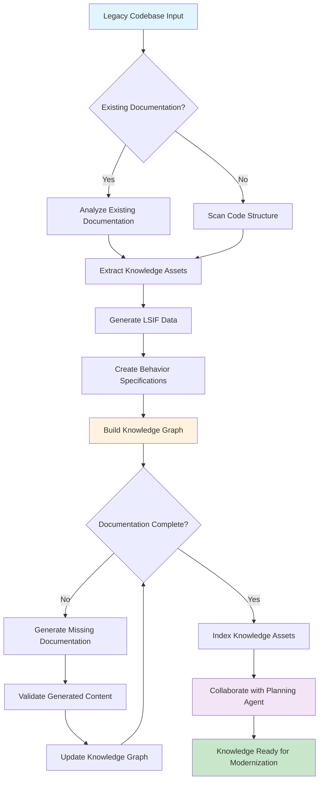
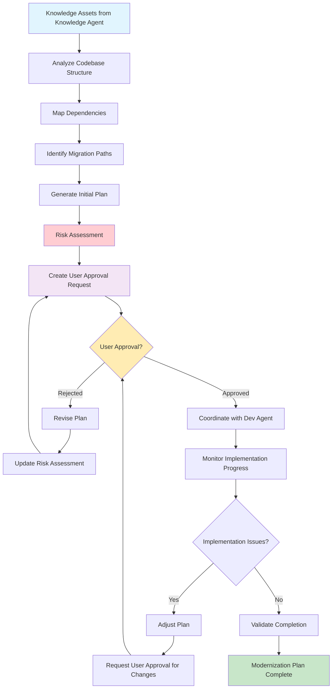
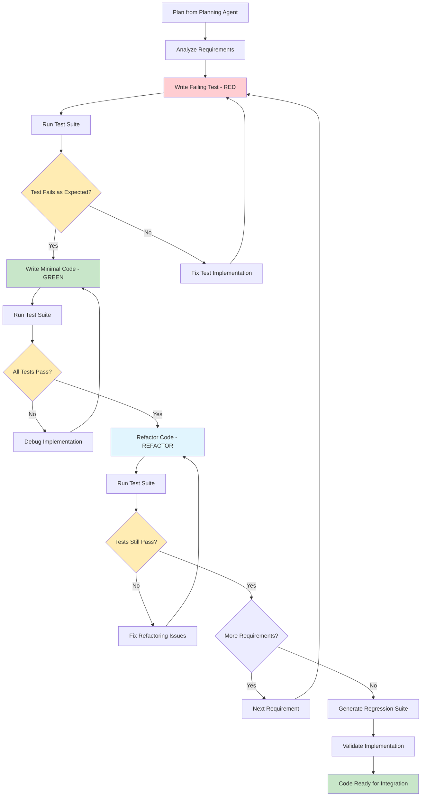
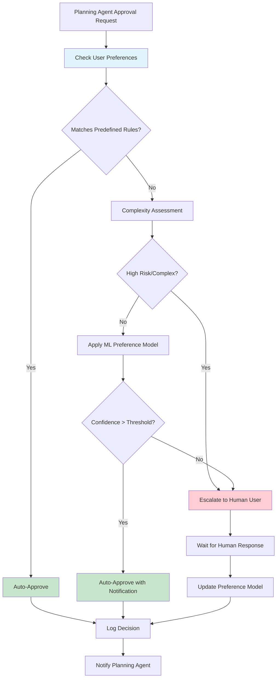
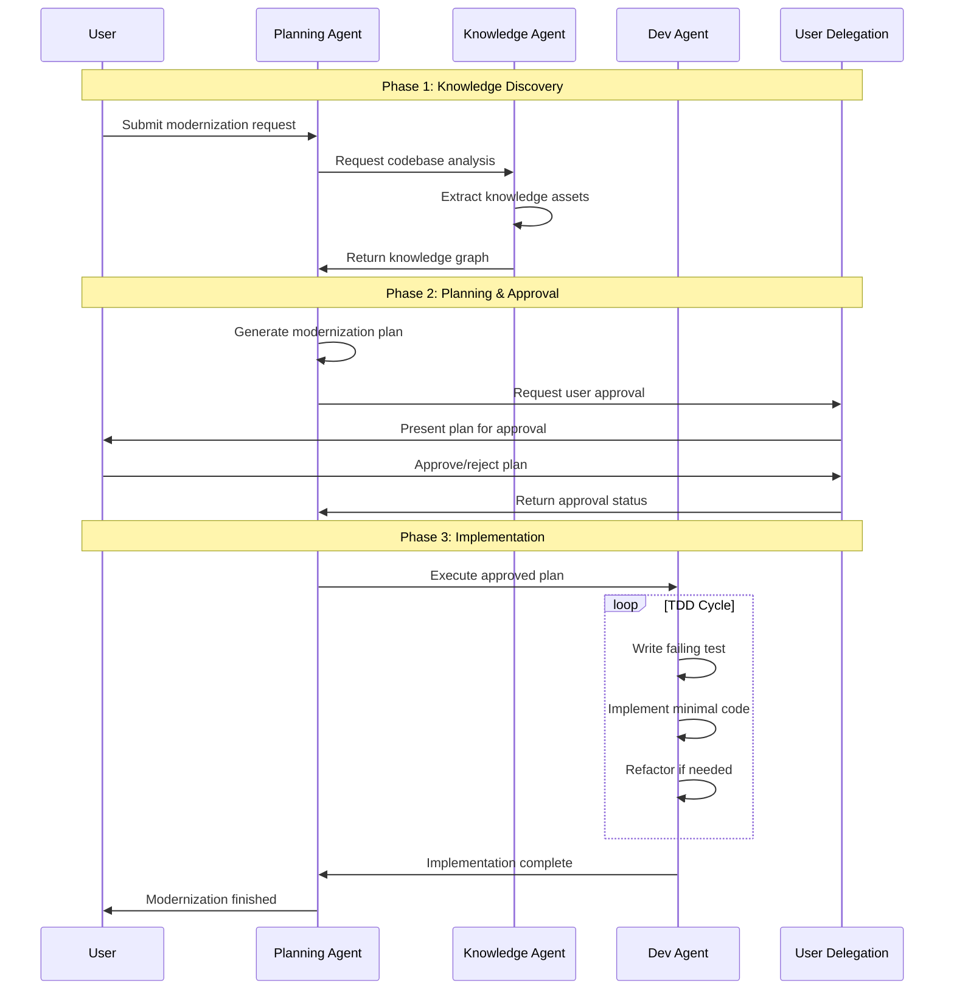

# Agent Architecture

## Overview

The modernization system consists of specialized agents implemented as Semantic Kernel ChatCompletionAgents, each with distinct responsibilities and capabilities. These agents coordinate through AgentGroupChat and Semantic Kernel Process Framework to orchestrate complex modernization workflows.

## Core Agents

### 1. Knowledge Agent (ChatCompletionAgent)

**Purpose**: Retrieve, generate, and index knowledge assets at multiple abstraction levels

**Implementation**: Semantic Kernel ChatCompletionAgent with specialized plugins for knowledge extraction and generation

**Responsibilities**:
- Analyze existing code comments and documentation
- Generate missing code documentation  
- Create and maintain LSIF (Language Server Index Format) data
- Generate Gherkin behavior specifications
- Index knowledge assets in graph database
- Ingest existing knowledge when available
- Collaborate with Planning Agent for knowledge generation plans

**Capabilities**:
- Multi-level knowledge extraction (syntactic, semantic, behavioral)
- Knowledge graph construction and maintenance
- Document generation and validation
- Integration with existing documentation systems

**Knowledge Agent Workflow**:


### 2. Planning Agent (ChatCompletionAgent)

**Purpose**: Coordinate workflow planning and user collaboration for modernization efforts

**Implementation**: Semantic Kernel ChatCompletionAgent with specialized plugins for analysis and planning

**Responsibilities**:
- Index codebase and build initial knowledge graph
- Coordinate with Knowledge Agent for asset generation planning
- Generate modernization/migration plans
- Seek user approval for all plans and revisions
- Handle dependency analysis and architectural shift planning
- Generate Test-Driven Development plans
- Coordinate with Dev Agent for plan execution

**Capabilities**:
- Codebase analysis and indexing
- Dependency mapping and conflict resolution
- Migration path identification
- User collaboration workflows
- Plan versioning and approval tracking

**Planning Agent Workflow**:


### 3. Dev Agent (ChatCompletionAgent)

**Purpose**: Execute development tasks following TDD methodology

**Implementation**: Semantic Kernel ChatCompletionAgent with specialized plugins for code generation and testing

**Responsibilities**:
- Implement minimal code signatures to make tests pass
- Follow language-specific interface patterns:
  - TypeScript & C#: Interfaces
  - Python: Protocols and Abstract Base Classes
  - Swift: Protocols and Interfaces
- Generate regression test suites
- Apply red-green-refactor TDD cycles
- Implement bare minimum code without stubbing

**Capabilities**:
- Multi-language code generation
- Test-first development approach
- Incremental implementation
- Code quality validation

**Dev Agent TDD Workflow**:


### 4. User Delegation Agent (ChatCompletionAgent - Optional)

**Purpose**: Represent user interests and preferences in automated workflows

**Implementation**: Semantic Kernel ChatCompletionAgent with user preference modeling plugins

**Responsibilities**:
- Maintain user preferences and constraints
- Provide automated approval for predefined scenarios
- Escalate complex decisions to human users
- Track user feedback and learning patterns

**User Delegation Workflow**:


### 5. Orchestration Agent (ChatCompletionAgent - Optional)

**Purpose**: High-level coordination and monitoring of the entire workflow

**Implementation**: Semantic Kernel ChatCompletionAgent with system monitoring and coordination plugins

**Responsibilities**:
- Monitor overall workflow health
- Handle cross-agent coordination issues
- Provide system-wide metrics and reporting
- Manage resource allocation and prioritization

## Agent Interaction Patterns

### Multi-Agent Sequence Flow


## Agent Configuration

### Semantic Kernel ChatCompletionAgent Setup
```csharp
// Example: Knowledge Agent Configuration
ChatCompletionAgent knowledgeAgent = new()
{
    Name = "KnowledgeAgent",
    Instructions = """
        You are a Knowledge Agent specialized in analyzing codebases and generating 
        comprehensive knowledge assets. Extract and generate code documentation, 
        maintain LSIF data, and create behavior specifications.
        """,
    Kernel = kernel,
    Arguments = new KernelArguments(new Dictionary<string, object?>
    {
        { "max_tokens", 4000 },
        { "temperature", 0.1 } // Low temperature for consistent analysis
    })
};
```

### Agent Plugin Integration
- **Knowledge Extraction Plugins**: Code analysis, documentation generation
- **Planning Plugins**: Dependency analysis, migration strategy generation
- **Development Plugins**: Test generation, code implementation, refactoring
- **Approval Plugins**: User preference modeling, decision automation

## Scalability and Performance

### Agent Scaling Patterns
- **Independent Scaling**: Each agent service scales based on workload
- **Resource Isolation**: Separate compute resources per agent type
- **Load Balancing**: Multiple instances for high-throughput scenarios
- **Stateless Design**: Agents maintain state through external storage

### Performance Optimization
- **Async Operations**: Non-blocking agent interactions
- **Caching**: Knowledge graph and analysis result caching
- **Batch Processing**: Efficient handling of large codebases
- **Parallel Execution**: Concurrent agent operations where appropriate

---

*This architecture provides the foundation for scalable, intelligent multi-agent modernization workflows.*
