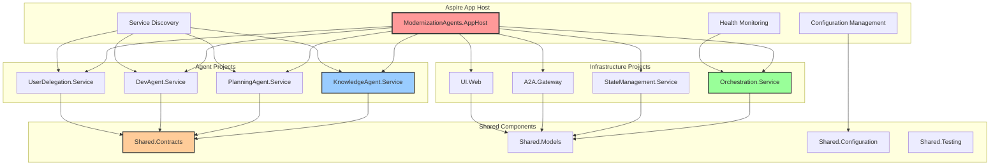
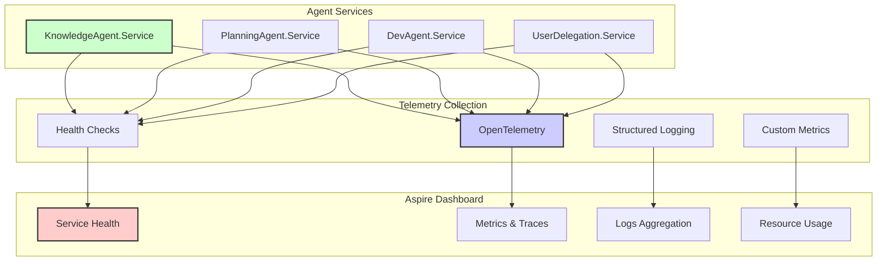

# .NET Aspire Multi-Project Architecture

## Overview

The modernization agent system is implemented as a distributed .NET Aspire application with each agent running as an independent project, enabling scalable and observable multi-agent workflows. This architecture provides built-in service discovery, health monitoring, and observability while maintaining clear separation of concerns.

## Aspire Project Structure

### Application Composition


## Project Structure Details

### Agent Projects
- **KnowledgeAgent.Service**: Legacy code analysis and knowledge extraction
- **PlanningAgent.Service**: Modernization planning and user collaboration
- **DevAgent.Service**: Test-driven development implementation
- **UserDelegation.Service**: User preference management and automated approvals

### Infrastructure Projects
- **Orchestration.Service**: Process Framework coordination and workflow management
- **StateManagement.Service**: Distributed state management with Dapr integration
- **A2A.Gateway**: External agent communication gateway
- **UI.Web**: User interface for workflow monitoring and interaction

### Shared Components
- **Shared.Contracts**: A2A and Semantic Kernel integration interfaces
- **Shared.Models**: Domain models and data transfer objects
- **Shared.Configuration**: Aspire configuration helpers and extensions
- **Shared.Testing**: Test utilities and Aspire TestHost integration

## Aspire Service Configuration

### AppHost Service Registration
```csharp
// ModernizationAgents.AppHost/Program.cs
var builder = DistributedApplication.CreateBuilder(args);

// Infrastructure Services
var stateStore = builder.AddRedis("state-store")
    .WithPersistence();
    
var eventBus = builder.AddRabbitMQ("event-bus")
    .WithManagementPlugin();

// Agent Services
var knowledgeAgent = builder.AddProject<Projects.KnowledgeAgent_Service>("knowledge-agent")
    .WithReference(stateStore)
    .WithReference(eventBus)
    .WithEnvironment("AGENT_TYPE", "Knowledge")
    .WithReplicas(2); // Scale based on workload

var planningAgent = builder.AddProject<Projects.PlanningAgent_Service>("planning-agent")
    .WithReference(stateStore)
    .WithReference(eventBus)
    .WithReference(knowledgeAgent)
    .WithEnvironment("AGENT_TYPE", "Planning");

var devAgent = builder.AddProject<Projects.DevAgent_Service>("dev-agent")
    .WithReference(stateStore)
    .WithReference(eventBus)
    .WithReference(planningAgent)
    .WithEnvironment("AGENT_TYPE", "Development");

var userDelegation = builder.AddProject<Projects.UserDelegation_Service>("user-delegation")
    .WithReference(stateStore)
    .WithReference(eventBus)
    .WithEnvironment("AGENT_TYPE", "UserDelegation");

// Orchestration Service
var orchestrator = builder.AddProject<Projects.Orchestration_Service>("orchestrator")
    .WithReference(stateStore)
    .WithReference(eventBus)
    .WithReference(knowledgeAgent)
    .WithReference(planningAgent)
    .WithReference(devAgent)
    .WithReference(userDelegation);

// Web UI
var webApp = builder.AddProject<Projects.UI_Web>("web-ui")
    .WithReference(orchestrator)
    .WithExternalHttpEndpoints();

// A2A Gateway for external agent communication
var a2aGateway = builder.AddProject<Projects.A2A_Gateway>("a2a-gateway")
    .WithReference(orchestrator)
    .WithExternalHttpEndpoints();

builder.Build().Run();
```

## Individual Agent Service Implementation

### Agent Service Template
```csharp
// KnowledgeAgent.Service/Program.cs
var builder = WebApplication.CreateBuilder(args);

// Add Aspire service discovery and observability
builder.AddServiceDefaults();

// Add Semantic Kernel with agent configuration
builder.Services.AddSingleton<Kernel>(serviceProvider =>
{
    var kernelBuilder = Kernel.CreateBuilder();
    kernelBuilder.AddAzureOpenAIChatCompletion(
        deploymentName: builder.Configuration["AI:DeploymentName"]!,
        endpoint: builder.Configuration["AI:Endpoint"]!,
        apiKey: builder.Configuration["AI:ApiKey"]!);
    return kernelBuilder.Build();
});

// Add agent-specific services
builder.Services.AddSingleton<KnowledgeAgent>();
builder.Services.AddSingleton<IAgentService, KnowledgeAgentService>();

// Add A2A protocol support
builder.Services.AddA2AAgent(options =>
{
    options.AgentName = "KnowledgeAgent";
    options.AgentDescription = "Specialized in legacy code analysis and knowledge extraction";
    options.WellKnownPath = "/.well-known/agent.json";
});

// Add state management
builder.Services.AddStackExchangeRedisCache(options =>
{
    options.Configuration = builder.Configuration.GetConnectionString("state-store");
});

// Add health checks
builder.Services.AddHealthChecks()
    .AddCheck<AgentHealthCheck>("agent-health");

var app = builder.Build();

// Map Aspire defaults (health checks, metrics, etc.)
app.MapDefaultEndpoints();

// Map A2A endpoints
app.MapA2AEndpoints();

// Map agent-specific endpoints
app.MapAgentEndpoints();

app.Run();
```

## Inter-Agent Communication with Aspire

### Service-to-Service Communication
```csharp
public class PlanningAgentService : IAgentService
{
    private readonly HttpClient _httpClient;
    private readonly ILogger<PlanningAgentService> _logger;
    
    public PlanningAgentService(HttpClient httpClient, ILogger<PlanningAgentService> logger)
    {
        _httpClient = httpClient;
        _logger = logger;
    }
    
    public async Task<PlanningResult> GeneratePlanAsync(KnowledgeGraph knowledgeGraph)
    {
        // Call Knowledge Agent through Aspire service discovery
        var knowledgeResponse = await _httpClient.GetFromJsonAsync<KnowledgeDetails>(
            "https+http://knowledge-agent/api/knowledge/details");
            
        // Generate modernization plan
        var plan = await GenerateModernizationPlan(knowledgeGraph, knowledgeResponse);
        
        // Notify User Delegation service
        await _httpClient.PostAsJsonAsync(
            "https+http://user-delegation/api/approval/request", 
            new ApprovalRequest { Plan = plan });
            
        return plan;
    }
}
```

### Service Discovery Configuration
```csharp
// Configure named HTTP clients for service-to-service communication
builder.Services.AddHttpClient<IPlanningService, PlanningService>(client =>
{
    client.BaseAddress = new Uri("https+http://planning-agent");
});

builder.Services.AddHttpClient<IKnowledgeService, KnowledgeService>(client =>
{
    client.BaseAddress = new Uri("https+http://knowledge-agent");
});
```

## Aspire Observability and Monitoring

### Built-in Monitoring Stack


### Custom Telemetry Configuration
```csharp
// Add custom metrics for agent operations
builder.Services.AddSingleton<AgentMetrics>();

// Configure structured logging
builder.Logging.AddJsonConsole(options =>
{
    options.IncludeScopes = true;
    options.TimestampFormat = "yyyy-MM-dd HH:mm:ss ";
});

// Add OpenTelemetry tracing
builder.Services.AddOpenTelemetry()
    .WithTracing(tracing =>
    {
        tracing.AddAspNetCoreInstrumentation()
               .AddHttpClientInstrumentation()
               .AddSemanticKernelInstrumentation(); // Custom instrumentation
    });
```

## Deployment and Scaling

### Environment Configuration
```csharp
// Development environment with local services
if (builder.Environment.IsDevelopment())
{
    builder.Services.AddSingleton<IStateStore, InMemoryStateStore>();
}
else
{
    // Production environment with distributed services
    builder.Services.AddSingleton<IStateStore, RedisStateStore>();
    builder.Services.AddDapr();
}
```

### Scaling Configuration
```csharp
// Scale knowledge agent based on workload
var knowledgeAgent = builder.AddProject<Projects.KnowledgeAgent_Service>("knowledge-agent")
    .WithReplicas(builder.Environment.IsProduction() ? 3 : 1)
    .WithResourceLimits(memory: "2Gi", cpu: "1000m");
```

## Benefits of Aspire Architecture

### Development Experience
- **Unified Development**: Single F5 experience for all services
- **Integrated Debugging**: Debug across multiple services simultaneously
- **Live Reload**: Hot reload for rapid development cycles
- **Service Dependencies**: Automatic dependency management and startup ordering

### Production Readiness
- **Health Monitoring**: Built-in health checks and service status monitoring
- **Observability**: Comprehensive telemetry and distributed tracing
- **Configuration Management**: Centralized configuration with environment-specific overrides
- **Resource Management**: CPU and memory limits with scaling capabilities

### Operational Excellence
- **Service Discovery**: Automatic service registration and discovery
- **Load Balancing**: Built-in load balancing for scaled services
- **Fault Isolation**: Independent service failures don't affect the entire system
- **Deployment Flexibility**: Support for local, cloud, and hybrid deployments

---

*This Aspire architecture provides a robust foundation for scalable, observable, and maintainable multi-agent systems.*
