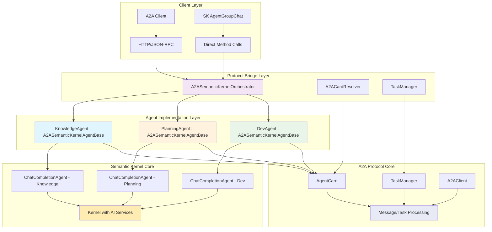

# Integration Architecture

## Overview

The integration architecture demonstrates how A2A protocol and Semantic Kernel agents work together through composition patterns, avoiding type duplication while maintaining clean separation of concerns. Each agent maintains its Semantic Kernel capabilities while exposing A2A protocol interfaces for standardized communication.

## A2A and Semantic Kernel Integration Architecture



## Design Principles and Benefits

### Composition over Inheritance
Rather than inheriting from either A2A or Semantic Kernel base classes, the `ModernizationAgent` class composes both a `ChatCompletionAgent` and A2A protocol components, avoiding the diamond problem and maintaining flexibility.

### Single Source of Truth
Agent metadata is defined once in shared interfaces (`IAgentMetadata`, `IAgentCapabilities`) and converted to both Semantic Kernel and A2A formats as needed, eliminating duplication.

### Protocol Agnostic
The same agent can be accessed via Semantic Kernel's native APIs or through A2A protocol endpoints without code duplication or behavioral differences.

### Lazy Initialization
A2A cards are created lazily to avoid overhead when only Semantic Kernel functionality is needed.

### Interface Segregation
Small, focused interfaces (`IAgentMetadata`, `IAgentCapabilities`, `IAgentSkill`) ensure components only depend on what they actually use.

### Factory Pattern
`ModernizationAgentFactory` encapsulates the complex setup while ensuring consistent configuration across all agent types.

## Core Integration Interfaces

### Agent Metadata Interface
```csharp
// Interface for agent metadata that both SK and A2A can use
public interface IAgentMetadata
{
    string Name { get; }
    string Description { get; }
    string Version { get; }
    IReadOnlyList<string> InputModes { get; }
    IReadOnlyList<string> OutputModes { get; }
    IReadOnlyDictionary<string, object> Properties { get; }
}
```

### Agent Capabilities Interface
```csharp
// Interface for agent capabilities shared between protocols
public interface IAgentCapabilities
{
    bool SupportsStreaming { get; }
    bool SupportsPushNotifications { get; }
    bool SupportsStateHistory { get; }
    IReadOnlyList<IAgentSkill> Skills { get; }
}
```

### Agent Skill Interface
```csharp
// Unified skill interface
public interface IAgentSkill
{
    string Id { get; }
    string Name { get; }
    string Description { get; }
    IReadOnlyList<string> Tags { get; }
    IReadOnlyList<string> Examples { get; }
}
```

### Bridge Interface
```csharp
// Bridge interface for A2A and SK integration
public interface IA2ASemanticKernelBridge
{
    ChatCompletionAgent SemanticKernelAgent { get; }
    AgentCard A2ACard { get; }
    Task<AgentMessage> ProcessA2AMessageAsync(Message message, CancellationToken cancellationToken);
    Task<AgentTask> ProcessA2ATaskAsync(AgentTask task, CancellationToken cancellationToken);
}
```

## Base Agent Implementation

### A2A-Enabled Semantic Kernel Agent Base
```csharp
// Base class for A2A-enabled Semantic Kernel agents
public abstract class A2ASemanticKernelAgentBase : IA2ASemanticKernelBridge, IDisposable
{
    protected readonly ChatCompletionAgent _semanticKernelAgent;
    protected readonly ILogger _logger;
    private readonly Lazy<AgentCard> _lazyAgentCard;

    protected A2ASemanticKernelAgentBase(
        ChatCompletionAgent semanticKernelAgent,
        ILogger logger)
    {
        _semanticKernelAgent = semanticKernelAgent;
        _logger = logger;
        _lazyAgentCard = new Lazy<AgentCard>(CreateAgentCard);
    }

    public ChatCompletionAgent SemanticKernelAgent => _semanticKernelAgent;
    public AgentCard A2ACard => _lazyAgentCard.Value;

    // Abstract methods for agent-specific metadata
    protected abstract IAgentMetadata GetAgentMetadata();
    protected abstract IAgentCapabilities GetAgentCapabilities();

    // Create A2A card from agent metadata
    private AgentCard CreateAgentCard()
    {
        var metadata = GetAgentMetadata();
        var capabilities = GetAgentCapabilities();

        return new AgentCard
        {
            Name = metadata.Name,
            Description = metadata.Description,
            Version = metadata.Version,
            InputModes = metadata.InputModes.ToList(),
            OutputModes = metadata.OutputModes.ToList(),
            Skills = capabilities.Skills.Select(skill => new Skill
            {
                Id = skill.Id,
                Name = skill.Name,
                Description = skill.Description,
                Tags = skill.Tags.ToList(),
                Examples = skill.Examples.ToList()
            }).ToList(),
            Properties = new Dictionary<string, object>(metadata.Properties)
            {
                ["supportsStreaming"] = capabilities.SupportsStreaming,
                ["supportsPushNotifications"] = capabilities.SupportsPushNotifications,
                ["supportsStateHistory"] = capabilities.SupportsStateHistory,
                ["protocol"] = "A2A-SK-Bridge"
            }
        };
    }

    // Common A2A task processing using SK agent
    public virtual async Task<AgentMessage> ProcessA2AMessageAsync(Message message, CancellationToken cancellationToken = default)
    {
        var userMessage = ExtractTextFromMessage(message);
        var responses = new List<string>();

        await foreach (var response in _semanticKernelAgent.InvokeAsync(userMessage, cancellationToken: cancellationToken))
        {
            responses.Add(response.Message.Content!);
        }

        return new AgentMessage
        {
            Content = string.Join("\n", responses),
            Timestamp = DateTimeOffset.UtcNow,
            AgentId = A2ACard.Name
        };
    }

    public virtual async Task<AgentTask> ProcessA2ATaskAsync(AgentTask task, CancellationToken cancellationToken = default)
    {
        var taskManager = new TaskManager(); // Injected dependency
        await taskManager.UpdateStatusAsync(task.Id, TaskState.Working, cancellationToken: cancellationToken);

        try
        {
            var userMessage = ExtractTextFromTask(task);
            var artifact = new Artifact();

            // Process with Semantic Kernel agent
            await foreach (var response in _semanticKernelAgent.InvokeAsync(userMessage, cancellationToken: cancellationToken))
            {
                artifact.Parts.Add(new TextPart { Text = response.Message.Content! });
            }

            // Return artifacts through A2A protocol
            await taskManager.ReturnArtifactAsync(task.Id, artifact, cancellationToken);
            await taskManager.UpdateStatusAsync(task.Id, TaskState.Completed, cancellationToken: cancellationToken);
            
            return task;
        }
        catch (Exception ex)
        {
            _logger.LogError(ex, "Error processing A2A task {TaskId} for agent {AgentName}", task.Id, A2ACard.Name);
            await taskManager.UpdateStatusAsync(task.Id, TaskState.Failed, cancellationToken: cancellationToken);
            throw;
        }
    }

    protected static string ExtractTextFromMessage(Message message)
    {
        return string.Join("\n", message.Parts.OfType<TextPart>().Select(p => p.Text));
    }

    protected static string ExtractTextFromTask(AgentTask task)
    {
        return task.History?.LastOrDefault()?.Parts.OfType<TextPart>().FirstOrDefault()?.Text ?? string.Empty;
    }

    public virtual void Dispose()
    {
        // Base cleanup - subclasses can override for additional cleanup
        GC.SuppressFinalize(this);
    }
}
```

## Agent Factory Implementation

### Modernization Agent Factory
```csharp
public class ModernizationAgentFactory
{
    private readonly Kernel _kernel;
    private readonly ILogger<ModernizationAgentFactory> _logger;

    public ModernizationAgentFactory(Kernel kernel, ILogger<ModernizationAgentFactory> logger)
    {
        _kernel = kernel;
        _logger = logger;
    }

    public KnowledgeAgent CreateKnowledgeAgent()
    {
        var chatAgent = new ChatCompletionAgent
        {
            Name = "KnowledgeAgent",
            Instructions = """
                You are a Knowledge Agent specialized in analyzing codebases and generating 
                comprehensive knowledge assets. Extract and generate code documentation, 
                maintain LSIF data, and create behavior specifications.
                """,
            Kernel = _kernel
        };

        return new KnowledgeAgent(chatAgent, _logger.CreateLogger<KnowledgeAgent>());
    }

    public PlanningAgent CreatePlanningAgent()
    {
        var chatAgent = new ChatCompletionAgent
        {
            Name = "PlanningAgent",
            Instructions = """
                You are a Planning Agent responsible for coordinating modernization workflows.
                Analyze dependencies, create migration plans, and coordinate with other agents
                while ensuring user approval for all major decisions.
                """,
            Kernel = _kernel
        };

        return new PlanningAgent(chatAgent, _logger.CreateLogger<PlanningAgent>());
    }

    public DevAgent CreateDevAgent()
    {
        var chatAgent = new ChatCompletionAgent
        {
            Name = "DevAgent",
            Instructions = """
                You are a Development Agent that follows Test-Driven Development principles.
                Implement minimal code to make tests pass, generate regression suites,
                and apply red-green-refactor cycles without stubbing implementations.
                """,
            Kernel = _kernel
        };

        return new DevAgent(chatAgent, _logger.CreateLogger<DevAgent>());
    }
}
```

## Agent Discovery and Communication

### A2A Package Integration
```csharp
public class A2AAgentOrchestrator
{
    private readonly Dictionary<string, ChatCompletionAgent> _localAgents;
    private readonly Dictionary<string, A2AClient> _agentClients;
    private readonly ILogger<A2AAgentOrchestrator> _logger;

    public A2AAgentOrchestrator(ILogger<A2AAgentOrchestrator> logger)
    {
        _localAgents = new Dictionary<string, ChatCompletionAgent>();
        _agentClients = new Dictionary<string, A2AClient>();
        _logger = logger;
    }

    // Register local agent for both SK and A2A access
    public void RegisterAgent(string name, A2ASemanticKernelAgentBase agent)
    {
        _localAgents[name] = agent.SemanticKernelAgent;
        
        // Register A2A endpoint for this agent
        RegisterA2AEndpoint(name, agent.A2ACard);
    }

    // Discovery using A2A well-known endpoints
    public async Task<List<AgentCard>> DiscoverA2AAgentsAsync(CancellationToken cancellationToken = default)
    {
        var discoveredAgents = new List<AgentCard>();
        
        // Discover agents using A2A protocol
        var discoveryClient = new A2ADiscoveryClient();
        var agents = await discoveryClient.DiscoverAgentsAsync(cancellationToken);
        
        foreach (var agent in agents)
        {
            if (!_agentClients.ContainsKey(agent.Name))
            {
                var client = new A2AClient(agent.BaseUrl);
                _agentClients[agent.Name] = client;
                discoveredAgents.Add(agent);
            }
        }
        
        return discoveredAgents;
    }

    // Send message to agent (either local SK or remote A2A)
    public async Task<AgentMessage> SendMessageAsync(
        string agentName, 
        string message, 
        CancellationToken cancellationToken = default)
    {
        // Prefer local Semantic Kernel agent if available
        if (_localAgents.TryGetValue(agentName, out var localAgent))
        {
            var responses = new List<string>();
            await foreach (var response in localAgent.InvokeAsync(message, cancellationToken: cancellationToken))
            {
                responses.Add(response.Message.Content!);
            }
            
            return new AgentMessage
            {
                Content = string.Join("\n", responses),
                Timestamp = DateTimeOffset.UtcNow,
                AgentId = agentName
            };
        }

        // Fall back to remote A2A agent communication
        if (_agentClients.TryGetValue(agentName, out var client))
        {
            var response = await client.SendMessageAsync(new MessageSendParams
            {
                Message = new Message
                {
                    Role = MessageRole.User,
                    Parts = [new TextPart { Text = message }]
                }
            }, cancellationToken);

            return response as AgentMessage ?? 
                throw new InvalidOperationException($"Unexpected response type from A2A agent {agentName}");
        }

        throw new InvalidOperationException($"Agent {agentName} not found in local or remote A2A registrations");
    }
}
```

## Benefits of Integration Architecture

### Dual Protocol Support
- **Semantic Kernel Native**: Direct access for high-performance local coordination
- **A2A Protocol**: Standardized communication for external agent integration
- **Seamless Switching**: Same agent accessible through both protocols

### Clean Architecture
- **Separation of Concerns**: Protocol-specific logic separated from agent logic
- **Composition Pattern**: Avoids inheritance complexity while maintaining flexibility
- **Interface-Based Design**: Clear contracts between components

### Scalability
- **Protocol Agnostic**: Add new communication protocols without changing agent logic
- **Discovery Integration**: Automatic agent discovery and registration
- **Performance Optimization**: Local SK access for internal coordination, A2A for external

---

*This integration architecture enables seamless coordination between Semantic Kernel agents and external A2A-compliant systems.*
