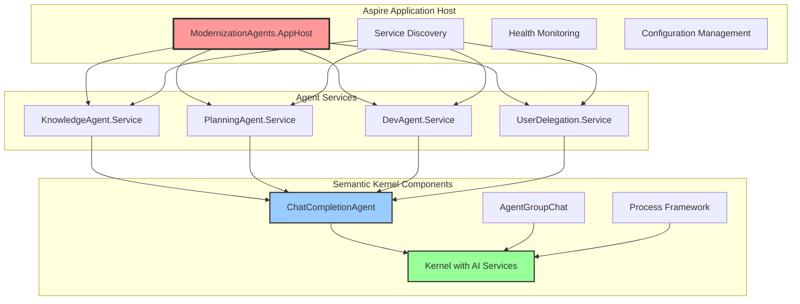

# Technical Foundation

## Core Technologies

### Agent Framework: Semantic Kernel Agent Framework (Latest Version)
- **Core Package**: `Microsoft.SemanticKernel` (C# .NET 8.0 SDK)
- **Agent Package**: `Microsoft.SemanticKernel.Agents.Core` (prerelease)
- **Orchestration Package**: `Microsoft.SemanticKernel.Agents.Orchestration` (prerelease)
- **ChatCompletionAgent**: Flexible AI service integration for conversational agents
- **AgentChat and AgentGroupChat**: Multi-agent coordination and communication

### Workflow Orchestration: Semantic Kernel Process Framework (Latest Version)
- **Package**: `Microsoft.SemanticKernel.Process.LocalRuntime` v1.46.0-alpha (experimental)
- **Alternative**: `Microsoft.SemanticKernel.Process.Runtime.Dapr` v1.46.0-alpha
- **Event-driven Architecture**: Step coordination and workflow orchestration
- **Process Definition**: Declarative workflow modeling with agent integration

### Application Hosting: .NET Aspire Platform (Latest Stable)
- **Multi-project Orchestration**: Independent agent scaling and deployment
- **Built-in Service Discovery**: Automatic service registration and discovery
- **Observability and Health Monitoring**: Comprehensive telemetry and health checks
- **Agent Isolation**: Each agent deployed as separate Aspire project for fault isolation and scalability

### Development Methodology: Test-Driven Development (TDD)
- **Based on Kent C. Beck's Testing Trophy Principles**
- **Red-Green-Refactor Cycle**: Test-first development approach
- **Minimal Code Implementation**: Write only enough code to make tests pass
- **Continuous Validation**: Ongoing test execution and validation

## Technology Integration Patterns

### Semantic Kernel + Aspire Integration

### Process Framework + Dapr Integration
- **Distributed Process Execution**: Process steps run across multiple Aspire services
- **State Management**: Dapr State Store for process state persistence
- **Event Coordination**: Dapr PubSub for inter-step communication
- **Service Invocation**: Dapr service invocation for cross-agent communication

### A2A Protocol Integration
- **Standardized Agent Communication**: JSON-RPC based with Server-Sent Events
- **AgentCard Discovery**: .well-known/agent.json for capability advertising
- **Seamless Integration**: Composition pattern with Semantic Kernel agents
- **Protocol Compliance**: A2A version 0.2.6 specification

## Development Stack

### Runtime Environment
- **.NET 8.0 SDK**: Primary development framework
- **C# Language**: Primary implementation language
- **Cross-platform Support**: Windows, Linux, macOS compatibility

### AI Services Integration
- **Azure OpenAI**: Primary AI service provider
- **OpenAI API**: Alternative AI service option
- **Semantic Kernel AI Services**: Abstraction layer for AI provider flexibility

### Database and Storage
- **Graph Database**: Knowledge graph storage and querying
- **Redis**: Distributed caching and state management
- **Blob Storage**: Artifact and document storage

### Communication and Messaging
- **RabbitMQ**: Event-driven messaging and pub/sub
- **HTTP/REST**: Service-to-service communication
- **gRPC**: High-performance inter-service communication
- **WebSockets**: Real-time user interaction

### Observability and Monitoring
- **OpenTelemetry**: Distributed tracing and metrics
- **Aspire Dashboard**: Development-time monitoring and diagnostics
- **Health Checks**: Service health monitoring and alerting
- **Structured Logging**: Comprehensive logging with correlation

## Quality Assurance Framework

### Testing Strategy
- **Unit Testing**: xUnit for .NET with comprehensive mocking
- **Integration Testing**: Aspire TestHost for service integration testing
- **End-to-End Testing**: Complete workflow validation
- **Performance Testing**: Load testing and scalability validation

### Code Quality
- **Static Analysis**: Code quality and security scanning
- **Code Coverage**: Minimum 80% coverage requirement
- **Linting and Formatting**: Consistent code style enforcement
- **Security Scanning**: Vulnerability detection and remediation

### Deployment and DevOps
- **CI/CD Pipelines**: Automated build, test, and deployment
- **Infrastructure as Code**: Repeatable environment provisioning
- **Container Support**: Docker containerization for consistent deployment
- **Environment Management**: Development, staging, and production environments

---

*This technical foundation provides the core technologies and patterns for implementing the agent workflow system.*
