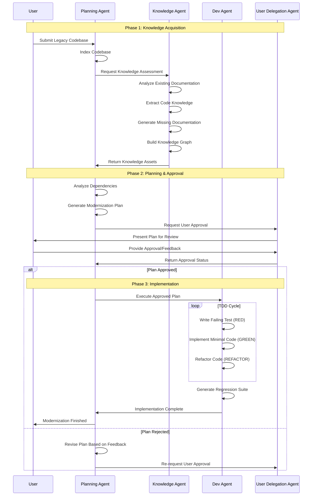
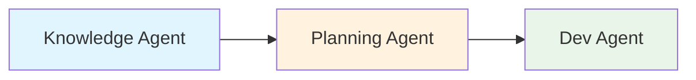
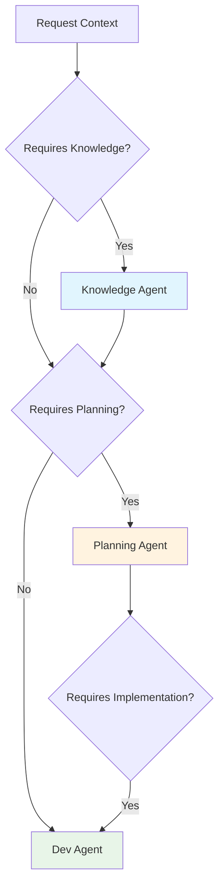
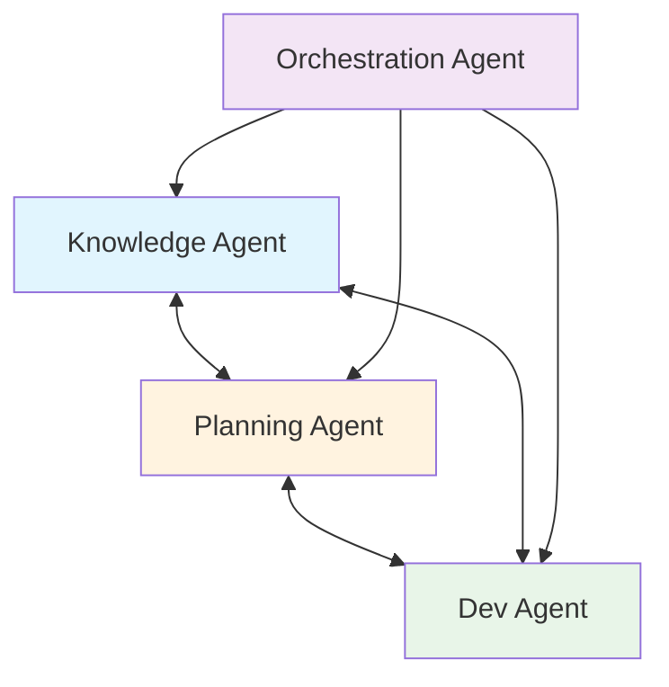

# Modernization Workflow Process

## Overview

The modernization workflow orchestrates multiple specialized agents through a coordinated, user-collaborative process that transforms legacy codebases while maintaining behavioral integrity and applying Test-Driven Development principles.

## Multi-Agent Modernization Workflow

## Workflow Phases

### Phase 1: Knowledge Discovery

**Objective**: Comprehensively understand the legacy codebase structure, behavior, and dependencies.

**Activities**:
1. **Codebase Indexing**: Planning Agent scans and indexes the entire codebase
2. **Knowledge Assessment**: Knowledge Agent analyzes existing documentation and comments
3. **Knowledge Extraction**: Multi-level analysis of code structure, patterns, and behavior
4. **Documentation Generation**: Create missing documentation for undocumented components
5. **Knowledge Graph Construction**: Build comprehensive relationship mappings
6. **Asset Validation**: Verify generated knowledge assets for accuracy

**Deliverables**:
- Complete codebase index
- Knowledge graph with component relationships
- Generated documentation for undocumented code
- Behavioral specifications in Gherkin format
- LSIF data for code navigation

### Phase 2: Target System Analysis

**Objective**: Define the target architecture and generate a comprehensive modernization plan.

**Activities**:
1. **Dependency Analysis**: Map all internal and external dependencies
2. **Architecture Assessment**: Evaluate current vs. target architectural patterns
3. **Migration Path Identification**: Determine optimal modernization sequence
4. **Risk Assessment**: Identify potential challenges and mitigation strategies
5. **Plan Generation**: Create detailed modernization plan with timelines
6. **User Collaboration**: Present plan for review and approval

**Deliverables**:
- Dependency map with conflict identification
- Target architecture specification
- Detailed migration plan with phases
- Risk assessment with mitigation strategies
- User approval documentation

### Phase 3: Plan Development and Approval

**Objective**: Collaborate with users to refine and approve the modernization approach.

**Activities**:
1. **Plan Presentation**: User Delegation Agent presents plan to stakeholders
2. **Feedback Collection**: Gather user input on proposed changes
3. **Plan Revision**: Incorporate feedback and adjust approach
4. **Approval Workflow**: Obtain explicit approval for implementation
5. **Progress Planning**: Define milestones and success criteria

**User Collaboration Requirements**:
- Explicit user approval required for:
  - Dependency changes
  - Architectural shifts
  - Conflicting requirements resolution
  - Migration/upgrade paths
- Plan versioning and change tracking

### Phase 4: Implementation Execution

**Objective**: Execute the modernization using Test-Driven Development methodology.

**Activities**:
1. **TDD Implementation Cycle**: Dev Agent follows red-green-refactor methodology
2. **Test-First Development**: Write failing tests before implementation
3. **Minimal Code Implementation**: Write only enough code to make tests pass
4. **Regression Test Suite**: Generate comprehensive tests for target system
5. **Iterative Development**: Continuous integration with test validation
6. **Progress Coordination**: Regular coordination with Planning Agent

**TDD Implementation Requirements**:
- Red-Green-Refactor cycle implementation
- No stubbing - actual implementation required
- Comprehensive test generation for target system
- Legacy system behavior preservation tests
- Cross-system integration tests

## Agent Coordination Patterns

### Sequential Orchestration

**Use Case**: Structured workflow phases where each agent completes its work before the next begins.

### Handoff Orchestration

**Use Case**: Dynamic agent selection based on request context and requirements.

### Group Chat Orchestration

**Use Case**: Collaborative decision-making requiring input from multiple agents.

## Quality Gates and Validation

### Knowledge Phase Gates
- **Completeness Check**: 95%+ codebase coverage in knowledge graph
- **Documentation Quality**: Generated documentation passes readability tests
- **Relationship Accuracy**: Dependency mappings validated against actual code

### Planning Phase Gates
- **Dependency Resolution**: All conflicts identified and resolution strategies defined
- **Risk Mitigation**: Comprehensive risk assessment with mitigation plans
- **User Approval**: Explicit stakeholder approval documented

### Implementation Phase Gates
- **Test Coverage**: 80%+ automated test coverage for modernized components
- **Behavioral Preservation**: Legacy system behavior validated in new implementation
- **Integration Testing**: Cross-system integration tests pass

## Error Handling and Recovery

### Workflow Resilience
- **Checkpoint Recovery**: Resume from last successful phase on failure
- **State Persistence**: All workflow state preserved across restarts
- **Agent Failover**: Automatic recovery from agent service failures

### User Intervention Points
- **Approval Timeouts**: Escalation procedures for delayed user responses
- **Conflict Resolution**: Human intervention for unresolvable conflicts
- **Quality Issues**: User review when automated quality gates fail

## Progress Tracking and Reporting

### Real-Time Monitoring
- **Phase Progress**: Visual progress indicators for each workflow phase
- **Agent Status**: Live status updates from all participating agents
- **Quality Metrics**: Real-time test coverage and quality measurements

### Stakeholder Communication
- **Progress Reports**: Regular updates on modernization progress
- **Issue Notifications**: Immediate alerts for problems requiring attention
- **Completion Summaries**: Comprehensive reports on completed modernization

---

*This workflow process ensures systematic, user-collaborative modernization with comprehensive quality assurance.*
